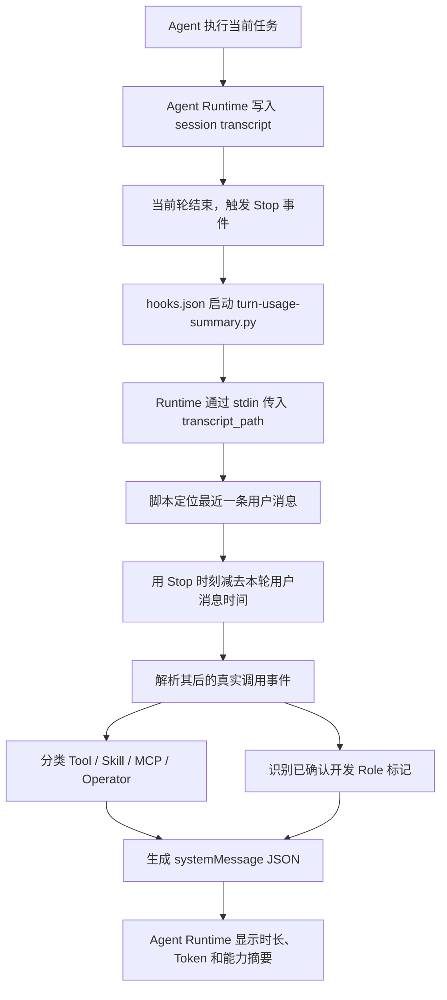

# 06-hook

## 摘要

Codex CLI 里的 Hook，可以理解成：

> 在 Agent 执行过程中的特定时间点，自动执行你定义的脚本或命令。

它和 Git Hook 很像，只不过监听对象不同：

| 类型 | 监听什么 | 触发什么 |
| --- | --- | --- |
| Git Hook | `commit`、`push`、`merge` 等 Git 事件 | shell 脚本、检查、格式化、阻断提交 |
| Codex Hook | Agent 生命周期事件，例如执行工具、编辑文件、运行 Bash、任务结束 | 自动测试、日志、安全检查、通知等 |

一句话记忆：

> Tool 是 Agent 主动调用；Hook 是 Runtime 在事件发生时自动触发。

Hook 不属于 Prompt，也不是模型推理能力。它属于 **Agent Runtime** 的执行控制能力。

```text
Prompt
↓
LLM
↓
Agent Runtime
↓
Hook
↓
Tool / Script
```

## 当前本机：本轮能力展示 Stop Hook

### 结论

本轮能力展示是一个**挂在 Agent Runtime 生命周期上的自定义可观测性能力**，不是 Codex Runtime 原生自带的 Tool、Skill、MCP、Operator 统计面板。

Agent Runtime 负责提供 `Stop` 事件、session transcript 和 `systemMessage` 回显通道；本机 Python Hook 负责读取 transcript、划分本轮边界、识别能力调用并生成摘要。

```text
本轮执行时间 2分13秒
本轮 43.5k tokens | 上下文 16.8% | 累计 107.9k
开发 Role=iterative_feature_development
能力 Tool=exec_command,spawn_agent | Skill=multi-agent-framework-maintainer | MCP=- | Operator=stage_execution_runner
```

### 整体实现原理



这套方案的关键不是让模型在最终回答里“自报用了什么”，而是结束时读取 Runtime 已记录的执行事件。这样统计结果来自真实调用轨迹，不依赖模型记忆，也不会因为最终回答遗漏而消失。

### Runtime 和自定义脚本的职责边界

| 能力 | Agent Runtime 原生提供 | 本机自定义 Hook 提供 |
| --- | --- | --- |
| 生命周期 | 触发 `Stop` 事件 | 响应事件并执行统计 |
| 会话记录 | 写入 JSONL transcript | 读取并解析 transcript |
| 本轮定位 | 提供消息和调用事件 | 以最近一条用户消息为边界 |
| 能力分类 | 记录原始调用名称和参数 | 分类为 Tool / Skill / MCP / Operator |
| UI 回显 | 展示 `systemMessage` | 生成具体摘要文本 |
| multi-agent role | 从 `config.toml` 注册并调度 | 对照注册表识别实际参与的 role |

因此，准确说法是：

> 这是运行在 Agent Runtime 生命周期中的自定义 Hook 能力，不是 Runtime 内置统计功能。

### 文件组成

#### 1. Hook 注册

注册文件：`~/.codex/hooks.json`

```json
{
  "hooks": {
    "Stop": [
      {
        "hooks": [
          {
            "type": "command",
            "command": "/usr/bin/python3 /Users/heytea/.codex/hooks/turn-usage-summary.py",
            "timeout": 10
          }
        ]
      }
    ]
  }
}
```

每轮结束后，Agent Runtime 自动执行该脚本。Agent 本身不需要主动调用，也不需要在 prompt 中记住这件事。

#### 2. 统计脚本

实现文件：`~/.codex/hooks/turn-usage-summary.py`

脚本负责：

- 从标准输入读取 Hook JSON；
- 获取 `transcript_path`；
- 从最近一条用户消息时间计算本轮执行时长；
- 读取最近的 token 统计事件；
- 扫描当前轮的调用事件；
- 分类并去重能力名称；
- 识别 assistant 输出中的 `已确认开发 Role: <role>` 固定标记；
- 返回 `continue=true` 和 `systemMessage`。

#### 3. multi-agent role 真值

注册文件：`~/.codex/config.toml`

只有 `[agents.<name>]` 下已经注册的 role 才能计入 `Operator`。当前识别范围覆盖：

- `control_*`
- `stage_*`
- `tool_*`
- `gate_*`

草稿文件、文档里出现的名称、模型仅建议使用但没有实际调度的 role，都不会计入。

### 本轮边界如何确定

transcript 是整场 session 的追加日志。如果直接扫描全部内容，就会把前几轮使用过的能力也算进来。

当前实现按顺序读取 transcript：

```text
发现 role=user 的 message
↓
清空当前统计集合
↓
继续记录后续调用事件
↓
再次发现用户消息时重新清空
```

因此扫描结束后，保留下来的自然就是最近一条用户消息之后发生的调用，也就是当前轮。

### 四类能力如何识别

#### Tool

Tool 来自 transcript 中真实的 `function_call`、`custom_tool_call` 等调用事件。

当调用经过 `functions.exec` 包装时，脚本会继续展开其中实际出现的 `tools.<name>()`，例如：

```text
functions.exec
└─ tools.exec_command
└─ tools.view_image
└─ tools.apply_patch
```

最终展示有业务意义的底层 Tool，而不是只显示外层 `exec`。

#### Skill

Skill 通过实际执行命令中读取过的 `.../skills/<skill-name>/SKILL.md` 路径识别。

例如：

```bash
sed -n '1,240p' ~/.codex/skills/multi-agent-framework-maintainer/SKILL.md
```

会记录为：

```text
Skill=multi-agent-framework-maintainer
```

这可以证明 Skill 指令文件确实进入了本轮上下文，但不能单独证明 Agent 完整遵守了 Skill 中的每一条规则。规则是否被正确执行，仍需要结合产物、调用证据和 Gate 判断。

#### MCP

MCP 识别两种记录形式：

- 调用名符合 `mcp__<server>__<tool>`；
- transcript 事件类型为 `mcp_tool_call`。

展示时会把：

```text
mcp__exa__search
```

格式化为：

```text
MCP=exa.search
```

#### Operator

这里的 `Operator` 指本轮实际参与的 multi-agent role，不只是 `tool_*` 工具层。

识别流程：

1. 从 `~/.codex/config.toml` 读取所有已注册 `[agents.<name>]`；
2. 检查真实的 `spawn_agent`、`followup_task`、`send_message`、`interrupt_agent` 调度事件；
3. 从 `task_name`、`target`、`agent`、`agent_type`、`role` 等路由参数中提取 role；
4. 只有名称与已注册 role 匹配时才计入。

例如：

```text
Operator=control_request_router,stage_task_planner,tool_dbauto_sql_operator
```

如果本轮始终由根 Agent 自己执行，没有实际启动注册 role，则显示：

```text
Operator=-
```

### 输出和长度控制

统计结果按首次出现顺序去重。每一类最多展示 6 项，超过部分使用 `+N` 收起：

```text
Tool=exec_command,view_image,apply_patch,+3
```

空集合显示 `-`，避免用户分不清“没有使用”和“统计失败”。

开发 workflow 选定或确认 role 时，全局 `~/.codex/AGENTS.md` 要求回复包含固定标记：

```text
已确认开发 Role: iterative_feature_development
```

Stop Hook 只识别该固定标记，并额外展示：

```text
开发 Role=iterative_feature_development
```

非业务个人事务使用独立标记：

```text
已确认 Role: solve_personal_problem
```

Stop Hook 对该 Role 展示：

```text
Role=solve_personal_problem
```

这样既保留开发 Role 的原有显示，也不会把个人事务误判成迭代开发；方案比较中的候选 role、尚未确认的 role 或普通文本里的 `role=` 仍不会被误报。

脚本最终向 Agent Runtime 返回：

```json
{
  "continue": true,
  "systemMessage": "本轮执行时间 ...\n本轮 ...\n开发 Role=... 或 Role=...\n能力 Tool=... | Skill=... | MCP=... | Operator=..."
}
```

Codex 会把 `systemMessage` 固定渲染成 warning，因此界面中的第一行实际显示为：

```text
warning: 本轮执行时间 2分13秒
```

Hook 当前没有可用于在 warning 之前插入普通文本的独立输出字段；脚本能控制的是 warning 内各行的先后顺序。

这里只返回能力名称，不返回 Tool 参数、命令正文、网页内容、Token、Cookie 或查询结果，避免 Stop 回显泄露敏感信息。

### 验证方案

脚本保留了一个不依赖测试框架的最小自检：

```bash
/usr/bin/python3 ~/.codex/hooks/turn-usage-summary.py --self-test
```

语法检查：

```bash
/usr/bin/python3 -m py_compile ~/.codex/hooks/turn-usage-summary.py
```

也可以拿一个真实 transcript 模拟 Stop Hook：

```bash
printf '%s' '{"transcript_path":"<session-transcript.jsonl>"}' \
  | /usr/bin/python3 ~/.codex/hooks/turn-usage-summary.py
```

验证重点：

- 只统计最近一轮；
- Skill 名称来自真实 `SKILL.md` 读取；
- MCP 不混入普通 Tool；
- Operator 只包含真实调度且已经注册的 role；
- 只有包含固定确认标记的轮次才展示开发 Role 或个人事务 Role；
- 没有调用时明确显示 `-`。

### 当前边界

- Skill 统计证明“被加载”，不证明“全部规则被正确执行”。
- Operator 只统计真实调度，不统计仅被规划或推荐但没有启动的 role。
- Role 是本轮显式确认的 workflow 分类，不等同于实际调度的 multi-agent Operator；`solve_personal_problem` 也不代表新增了一个 `tool_*` Operator。
- 根 Agent 不属于 `config.toml` 中的四层注册 role，因此不会显示为 Operator。
- 本轮执行时间从最近一条用户消息的 transcript 时间戳计算到 Stop hook 执行时刻，包含模型推理、工具执行和等待时间。
- 当前每次 Stop 都会顺序扫描 transcript；session 极大时可升级为按文件偏移量增量读取。
- 当前只展示整轮总时长；不统计单个能力调用的成功率、耗时、失败原因和调用次数。

### 后续升级方案

1. 为每次能力调用记录 `success / failed / blocked` 状态。
2. 增加单个能力的调用次数和耗时，例如 `exec_command×4 (2.1s)`。
3. 将 `selected_operator / invocation_mode / invocation_proof` 接入 Operator 展示。
4. 保存每轮结构化 JSON，用于后续做 session 级统计和 dashboard。
5. 增加 Skill 合规检查，把“已加载”与“关键规则已执行”分成两个状态。

## 核心内容

### 1. 为什么需要 Hook

假设 Agent 正在写代码：

```text
LLM
↓
修改文件
↓
运行测试
↓
提交结果
```

如果没有 Hook，每一步都需要 Agent 自己决定：

```text
要不要运行测试？
要不要格式化？
要不要 lint？
要不要记录日志？
这个命令危险吗？
```

有了 Hook，就可以变成：

```text
Agent 修改文件
↓
AfterEdit Hook 自动触发
↓
自动执行：
npm test / pytest / ruff / mvn test
```

Agent 不需要每次都“想起来”这些规则。Runtime 会在事件发生时自动执行。

这就是 Hook 的核心价值：

- 把开发规范自动化
- 把安全边界前置
- 把执行轨迹记录下来
- 把团队固定流程从 prompt 里移到 runtime 里

### 2. Hook 本质上是 Event → Hook → Script

可以把 Hook 理解成事件系统：

```text
Event
↓
Hook
↓
Script / Command
```

例如：

```text
Before Tool Call
↓
hook
↓
记录日志 / 检查权限 / 拦截危险操作
```

或者：

```text
After Edit
↓
hook
↓
自动格式化代码 / 自动 lint / 自动测试
```

一个典型 Bash 执行流程：

```text
Agent
↓
准备执行 Bash
↓
BeforeBash Hook
↓
允许 / 拒绝 / 要求确认
↓
真正执行 Bash
↓
AfterBash Hook
↓
记录日志 / 统计耗时 / 分析结果
```

这里的重点是：

> Hook 不是 Agent 显式调用的工具，而是 Runtime 在生命周期节点自动插入的动作。

### 3. Hook 常见用途

#### 3.1 自动格式化

Python：

```text
Agent 修改 Python 文件
↓
AfterEdit Hook
↓
ruff format
```

Java：

```text
Agent 修改 Java 文件
↓
AfterEdit Hook
↓
google-java-format
```

JavaScript / TypeScript：

```text
Agent 修改 JS / TS 文件
↓
AfterEdit Hook
↓
prettier
```

适合场景：

- 不想每次提醒 Agent 格式化
- 团队已有统一格式化工具
- 改动后希望立刻保持 diff 干净

#### 3.2 自动 Lint

```text
保存代码
↓
Hook
↓
ruff check / eslint / checkstyle / golangci-lint
```

Lint Hook 的价值不是“替代 review”，而是把低级问题尽早拦住。

常见规则：

- Python：`ruff check`
- JS / TS：`eslint`
- Java：`mvn checkstyle:check` 或团队自定义 lint
- Go：`golangci-lint run`

#### 3.3 自动测试

例如：

```text
修改 backend/
↓
Hook
↓
pytest
```

或者：

```text
修改 Java service
↓
Hook
↓
mvn test
```

测试 Hook 要注意粒度：

| 粒度 | 适合什么时候 |
| --- | --- |
| 单文件 / 相关测试 | AfterEdit，反馈快 |
| 模块级测试 | 改完一个阶段后 |
| 全量测试 | 任务结束前，或者 CI 前 |

不要把特别慢的全量测试挂在每次编辑后，否则会拖垮 Agent 的执行效率。

#### 3.4 自动禁止危险操作

例如 Agent 想执行：

```bash
rm -rf /
```

Hook 可以在 BeforeBash 阶段检查命令：

```text
发现 rm -rf /
↓
拒绝执行
```

安全控制类 Hook 常见用途：

- 拦截 `rm -rf /`
- 拦截删除家目录、仓库根目录、大范围 `*.env` 操作
- 限制访问公司敏感目录
- 阻止写生产数据库
- 要求危险命令进入人工审批

这类 Hook 是把“安全边界”从口头约束变成 Runtime 级别约束。

#### 3.5 自动记录日志

例如每次 Tool Call 都写入日志：

```text
Tool Call
↓
Hook
↓
logs/agent-actions-2026-07-12.log
```

可以记录：

- 调用了什么工具
- 输入参数摘要
- 执行耗时
- 是否成功
- 错误信息
- 当前任务 ID / 会话 ID

以后可以用于分析 Agent 行为：

- 哪些工具最常用
- 哪类命令最容易失败
- 哪些任务耗时最长
- Agent 是否频繁重复同一类错误

#### 3.6 自动通知

例如：

```text
任务完成
↓
Hook
↓
飞书 / Slack / 邮件
```

适合长任务：

- 后台跑测试
- 批量修复 issue
- 生成报告
- 多 Agent 任务完成合并

通知类 Hook 的价值是：让 Agent 长时间运行时，人不用一直盯着终端。

### 4. Hook 和 Tool 的区别

这组概念很容易混。

#### Tool：Agent 主动调用

```text
Agent
↓
主动调用
↓
Git Tool
```

例如：

```bash
git status
```

这是 Agent 判断“我现在需要看 Git 状态”，然后主动调用工具。

#### Hook：Runtime 自动触发

```text
Agent
↓
事件发生
↓
Runtime 触发 Hook
↓
执行脚本
```

Agent 不需要知道这个 Hook 存在。

| 对比项 | Tool | Hook |
| --- | --- | --- |
| 谁触发 | Agent / LLM 决定 | Runtime 根据事件触发 |
| 是否需要 Agent 主动调用 | 需要 | 不需要 |
| 典型用途 | 查询、编辑、执行、访问外部系统 | 自动检查、拦截、记录、通知 |
| 类比 | 函数调用 / RPC | 事件监听器 / 中间件 |
| 位置 | Agent 可用能力列表里 | Runtime 生命周期节点里 |

一句话：

> Tool 是 Agent 主动；Hook 是 Runtime 主动。

### 5. Hook 和 MCP 的区别

MCP 是 Model Context Protocol，主要用于把外部能力暴露成 Agent 可调用的工具。

```text
Agent
↓
调用
↓
MCP Tool
```

Hook 是 Runtime 对执行事件的监听与自动动作：

```text
Agent Runtime
↓
监听事件
↓
执行脚本
```

| 对比项 | MCP | Hook |
| --- | --- | --- |
| 层次 | 工具协议 / 外部工具接入 | Runtime 生命周期机制 |
| 触发方式 | Agent 主动调用 MCP Tool | Runtime 根据事件自动触发 |
| 主要用途 | 连接外部系统，如 GitHub、DB、浏览器、IM | 自动化、审计、安全、通知 |
| 是否是工具 | 是，通常表现为工具 | 不是工具，是事件机制 |

所以两者完全不是一个层次：

> MCP 解决“Agent 能调用什么外部能力”；Hook 解决“Agent 执行过程中哪些节点要自动做事”。

### 6. 在 Codex CLI 中一般怎么用

最常见的 Hook 场景可以分成五类。

#### 6.1 开发规范

```text
After Edit
↓
ruff format
↓
ruff check
```

或者：

```text
After Edit
↓
prettier
↓
eslint
```

目标：让代码风格和基础质量检查自动化。

#### 6.2 测试

```text
After Edit
↓
pytest
```

或者：

```text
After Edit
↓
mvn test
```

更稳妥的做法：

- 小改动后跑相关测试
- 阶段完成后跑模块测试
- 任务结束前跑全量测试

#### 6.3 Git 检查

任务结束时自动执行：

```bash
git diff
```

或者：

```bash
git status
```

目标：避免 Agent 结束时留下未说明的改动、未跟踪文件或意外删除。

#### 6.4 日志审计

```text
每次 Tool
↓
写日志
```

适合团队追踪 Agent 的行为，尤其是多人共享的 AI coding 环境。

#### 6.5 安全阻断

```text
Before Bash
↓
检查命令
↓
危险命令
↓
拒绝 / 要求确认
```

这类 Hook 是 Codex CLI 在工程团队里最值得重视的能力之一。

### 7. AI 工程团队里的 Hook 流水线

如果是团队级 AI coding，典型流程会长这样：

```text
Agent
↓
Edit
↓
Hook: Format
↓
Hook: Lint
↓
Hook: Test
↓
Hook: Coverage
↓
Hook: Commit Check
↓
Done
```

这套流程的本质是：

> 把团队工程纪律从“希望 Agent 记住”升级为“Runtime 自动执行”。

Prompt 适合描述意图和原则；Hook 适合执行确定性流程。

### 8. 我当前阶段应该重点研究的 3 类 Hook

结合最近在研究 Codex CLI、Hermes、OpenAI Agent SDK、Multi-Agent，Hook 先重点看三类就够了。

#### 8.1 开发自动化

目标：让 Agent 改代码后自动进入质量门禁。

重点命令：

- `ruff format`
- `ruff check`
- `prettier`
- `eslint`
- `pytest`
- `mvn test`

适合研究的问题：

- Hook 应该在每次 edit 后跑，还是任务结束前跑？
- 如何只跑受影响目录的测试？
- 慢测试如何放到后台或 CI？

#### 8.2 安全控制

目标：阻止 Agent 做危险事。

重点方向：

- 拦截危险 Bash 命令
- 限制修改某些目录
- 禁止读取或写入敏感文件
- 审计所有 Tool 调用
- 对高风险操作要求人工确认

适合研究的问题：

- 哪些命令永远禁止？
- 哪些命令允许但要确认？
- 哪些目录对 Agent 只读？

#### 8.3 Agent 可观测性

目标：让 Agent 行为可追踪、可复盘、可优化。

重点方向：

- 记录每次 Tool 调用
- 统计耗时和成功率
- 保存执行轨迹 Trace
- 记录失败重试原因
- 为长任务生成审计日志

适合研究的问题：

- 如何把 Hook 日志转成 dashboard？
- 如何分析 Agent 最容易失败的环节？
- 如何比较不同模型 / 不同 prompt 的执行质量？

## 可执行动作

- [ ] 后续看 Codex CLI hooks 官方文档时，重点确认具体事件名、配置文件位置和参数格式。
- [ ] 在个人项目里先做最小 Hook：`AfterEdit → format/lint`，不要一开始就挂全量测试。
- [ ] 安全 Hook 先覆盖危险 Bash：删除根目录、删除 home、访问敏感凭证、写生产环境。
- [ ] 可观测性 Hook 先记录 Tool 名称、耗时、成功/失败，不急着做复杂 dashboard。
- [ ] 把 Hook 和 [[00-Agent Runtime总览]] 放在一起理解：Hook 是 Runtime 的生命周期扩展点。

## 相关链接

- [[Codex规则放哪里以及常用命令]]
- [[Codex启动时会读取什么]]
- [[Codex agent会读取哪些上下文]]
- [[Skill放在哪里以及怎么维护]]
- [[00-Agent Runtime总览]]
- [[LLM Runtime]]
