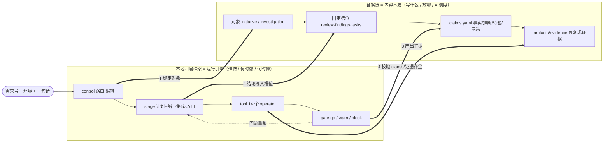
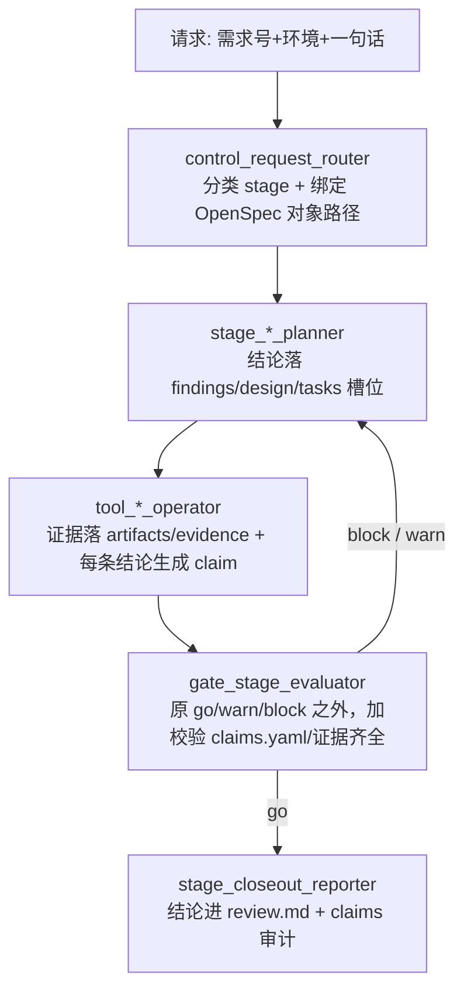

# OpenSpec 证据链体系研究

## 摘要

同事的 Agent 之所以「开发顺、不懒散」，不是因为模型更强，而是因为他给 Agent 套了一层**强约束的工作操作系统**：OpenSpec 协调层。核心就三件事——

1. **一条铁律**：能查的不记，只记查不到的。Agent 不靠人喂上下文，靠自己查仓库/表结构/命令。
2. **对象化工作流**：所有工作必须挂在一个「对象」上（正式需求 initiative / 排查 investigation / 插件 plugin-project），每个对象有固定的文档槽位，Agent 不能自由发挥目录。
3. **证据链闭环**：每一句结论都要带**可信度标签 + 证据来源**，登记进 `claims.yaml`，并且能被门禁脚本校验、被未来的证据推翻。

你现在「费力、懒散」，本质是缺了这层「先定对象 → 结论落固定槽位 → 每个断言挂证据 → 门禁卡关」的骨架。Agent 没有骨架就会随机漫游、重复问你、结论飘忽。这篇笔记把骨架拆开，方便你照抄。

> 研究对象：`/Users/heytea/Downloads/证据链/`（`AGENTS.md` + 一个真实 initiative 的 `artifacts/evidence/` 全量产物）。

## 核心内容

### 1. 顶层铁律：能查的不记，只记查不到的

`AGENTS.md` 开篇第一句就是铁律：

> agent 自己能查到的东西（catalogs/ 里的 repo、workspaces/ 里的代码、dbauto 查的表结构、operators 里的工具用法、命令清单）——不准写进任何 prompt、文档或交付物。
> 你唯一需要给 agent 的：**蓝鲸需求号 + 环境(cn/intl) + 一句话说清楚要做什么（≤50字）**。其余都靠查。

这条约束反向逼出了「顺畅」：

- 人不用写长 prompt，只给「需求号 + 环境 + 一句话」，**输入成本极低**。
- Agent 必须主动去查代码/表/命令，**不能偷懒问人**，也不能凭记忆瞎编。
- 文档不重复「查得到的东西」，所以文档短、不过时、可维护。

这就是「不懒散」的第一性原理：**把偷懒的路堵死（不准问、不准编），把查证的路铺平（工具齐、命令全）**。

### 2. 对象模型：一切工作必须挂在对象上

不允许「零散地改代码」。任何工作先归类成三种对象之一：

| 对象类型 | 目录 | 承载什么 | 核心结论落点 |
|---|---|---|---|
| 正式需求 `initiative` | `initiatives/` | 实现、测试、发布、closeout（必须有蓝鲸需求号） | `review.md` |
| 排查 `investigation` | `investigations/` | 现象、证据、根因候选、handoff | `findings.md` |
| 插件项目 `plugin-project` | `plugin-projects/` | 插件设计、实现、验证、发布 | 各自槽位 |

再加一个只读基座：`workspaces/cn|intl/` —— 只保留最新 `master`，用来「读代码」，**禁止**在里面开发。

**路径边界（关键）**：
- 排查读代码 → `workspaces/<env>/repos/<repo>`
- 需求改代码 → `initiatives/<initiative>/repos/<repo>`
- 插件改代码 → `plugin-projects/<project>/repos/<repo>`

也就是说「读用基座、改用对象自己的 repo」，物理隔离，Agent 不会把历史 clone 和当前需求搅在一起。这是它「不乱」的结构基础。

### 3. 文档槽位固定：禁止平行 md 树

这是治「懒散」最狠的一条。跨切铁律里明确：

1. 结论落盘：initiative → `review.md`；investigation → `findings.md`；进度/探索 → `tasks.md` 的 checkbox 下；过程产物 → `artifacts/generated|exploratory/`（gitignore）。
2. 断言性陈述必须打 `[级别·CL-nnn]` 标签，并登记到 `artifacts/evidence/claims/claims.yaml`。
3. 接口字段查 `repos/` 的 Java DTO，交付表放 `artifacts/derived/`，**禁止手写 `*接口文档.md`**。
4. **禁止 `task-implementation/` 或平行 md 树**；新信息合并进原文档，合并完删冗余。
5. 改动/分析/测试只发生在当前对象自己的 `repos/`。

效果：Agent 不能新建一堆 `方案v2.md`/`分析笔记.md`。它只有几个固定文件可写，信息不会散、不会重复、不会自我矛盾。

### 4. 证据链的心脏：`claims.yaml`

这是整套体系里最值得学的东西，也是「证据链」这个文件夹名字的来源。

每一个断言（claim）是一条结构化记录，样例：

```yaml
- id: CL-043
  credibility: fact          # fact | inference | pending | decision
  topic: trade→pms 已传 saleCompanyCode/currencyCode
  statement: 真实代码链路中 trade→PMS calculate 已显式传 saleCompanyCode/...
  source:
    - { kind: code, ref: "repos/manager-hsp-trade/.../PmsConvert.java" }
  refutableBy: null          # 什么证据能推翻这条断言
  risk: null
  staleDays: null            # 多少天后视为过期需复核
  locatedIn: ["review.md:203"]  # 这条断言在正文哪出现
```

四类可信度是重点：

| credibility | 含义 | 用法 |
|---|---|---|
| `fact` | 事实 | 有代码/证据直接支撑 |
| `inference` | 推断 | 基于现有信息合理推断，**必须带 `refutableBy` 反证** |
| `pending` | 待验 | 尚未验证，**必须带 `refutableBy` + `staleDays`** |
| `decision` | 决策 | 团队/评审拍板的约定 |

`source.kind` 也标准化：`prd | code | mr | evidence | dingtalk | meeting | convention`。

**为什么这治好了「结论飘忽」**：Agent 说的每句话都被迫标注「这是事实还是猜的、依据在哪、什么情况下会被推翻、多久要复查」。猜的东西被显式标成 `inference/pending`，不会被当成事实往下传。人 review 时一眼能看出哪些还没验。这就是「证据链」——结论 → 证据 → 可推翻条件，一条链都不断。

研究的这个 initiative 里 `claims.yaml` 攒了 **CL-001 ~ CL-128** 共 100+ 条断言，正文里用 `[fact·CL-043]` 这种标签引用，正文和台账双向锁定（`locatedIn` 指回正文行号）。

### 5. 证据的物理形态：`artifacts/evidence/`

claims 只是索引，真正的证据是一堆机器产出的、可复现的产物，分门别类：

| 证据目录 | 内容 | 作用 |
|---|---|---|
| `repo-preflight/` | 各仓分支/版本/dirty 状态快照(JSON) | 开工前证明「环境干净、版本对齐」 |
| `mr-batch/` | 批量扫 11 仓 MR + Bugbot CR 结果(JSON) | 证明代码评审通过情况（4 通过 / 7 未通过一目了然） |
| `cr-work-packets/` | 每仓一个待办工作包(YAML)：问题、定位行、修复动作、verify 命令 | 把 CR 意见转成可执行、可关闭的任务 |
| `subsidy-settlement-verify/` | trace 分析 + runbook + DDL/SQL 证据 | 联调实测的可复现记录 |
| `test-handoff/` | 8 张链路图（`.mmd` + 渲染 `.png`） | 给测试的交付物，链路一图看懂 |
| `frontend-seed/` | 造数脚本 + manifest | 前端联调样本数据可复现 |

关键特征：**这些几乎全是脚本/工具自动生成的**（batch JSON、trace summary、mmd 图），不是人手写。所以证据「便宜、可复现、不掺主观」。runbook（如 `runbook-20260701.md`）则把「怎么复现验证」写成步骤，下次直接照跑。

### 6. 工具与技能：把方法论沉淀成命令

体系不靠 prompt 讲方法，而是把方法封装成工具和 skill：

- **命令唯一来源** `bin/list-commands`；单个工具的用法/风险/确认规则查 `.agents/operators/<name>.yaml`，**不在 prompt 重复**（又是铁律的体现）。
- **工作流 recipe 在 `.agents/skills/`**：只写「流程与判断点」，不内联 CLI 用法。例如 `openspec-investigation-debug`（排查根因）、`openspec-repo-implement-tdd`（TDD 实现）、`openspec-mr-cr-fix`（修 MR/Bugbot）。
- **门禁脚本**：`bin/validate-workspace`（结构强校验）、`bin/check-claims`（校验 claims.yaml）、`bin/gitlab-mr triage|gate|verify`（CR 闭环）。
- **路由前缀**：`/investigate` `/initiative` `/plugin` `/check` `/promote` 等，把「我要干哪类活」显式化。

`bin/new-initiative` / `bin/new-investigation` 这类脚手架一键生成对象的必备目录结构，Agent 不用自己想「该建哪些文件」。

### 7. 一次完整闭环长什么样（以本 initiative 为例）

```text
给一句话(需求号+intl+"订货支持补贴金")
  → /initiative 建对象 + 脚手架
  → repo-preflight 证明环境干净          [证据落 repo-preflight/]
  → design.md/review.md 定契约            [每条决策打 decision·CL-nnn]
  → 按 tasks.md 顺序改各仓 repos/
  → mr-batch 扫 MR + Bugbot              [证据落 mr-batch/]
  → cr-work-packets 逐仓修 CR 到 verify pass
  → 联调 trace 分析 + runbook 沉淀        [证据落 subsidy-settlement-verify/]
  → test-handoff 出链路图交付测试
  → 全程结论回写 review.md，断言进 claims.yaml，门禁校验
```

每一步都有**输入约束**（铁律）、**产出槽位**（固定文件）、**证据落点**（artifacts）、**校验门禁**（bin 脚本）。Agent 没有「不知道下一步干嘛」的空档，这就是它顺畅的根因。

## 可执行动作

想把这套逻辑迁移到自己的 Agent，按性价比从高到低：

- [ ] **先抄铁律**：给自己的 AGENTS.md / 项目规则加一句「能查的不记，只记查不到的；不准把可查信息写进文档」。这条几乎零成本，立刻减少你喂 prompt 的负担。
- [ ] **引入 claims 习惯**：让 Agent 输出结论时强制标 `[事实/推断/待验/决策]` + 证据来源 + 反证条件。可以先用一个简单的 `claims.md` 表格起步，不必立刻上 YAML + 门禁。
- [ ] **固定文档槽位**：为你的工作定 2~3 个固定文件（如 `review.md` 放结论、`tasks.md` 放进度、`evidence/` 放证据），**禁止 Agent 新建平行 md**。
- [ ] **对象化**：把每个任务先归一个对象目录，读代码和改代码物理分开（只读基座 vs 对象 repo）。
- [ ] **证据自动化**：凡是能脚本产出的证据（分支状态、MR 扫描、trace、链路图）就用脚本产，不手写；产物落 `evidence/` 且可复现。
- [ ] **沉淀成 skill/命令**：反复用的流程写成 skill（只写流程+判断点），工具用法写进 operator，不塞进 prompt。
- [ ] （可选）**加门禁**：等 claims/槽位稳定后，写个校验脚本卡「断言必须有来源、待验必须有 staleDays」。

一句话总结可迁移的范式：**把「偷懒/瞎编」在流程上堵死，把「查证/落盘」用工具铺平，让每句结论都挂在一条能被推翻的证据链上。**

## 与本地四层 Agent 框架的联合（2026-07-02 补）

### 一句话结论

两套系统不冲突，是**互补的两半**：本地 `~/.codex` 四层框架是**运行引擎**（谁做、按什么顺序、何时停、何时放行），同事的 OpenSpec 证据链是**内容基质**（写什么、放哪个固定文件、每句话可信度多少、证据怎么复现）。把证据链塞进四层引擎里当「产物规范」，就得到一个既会自动跑流程、又强制留证据的完整体系。

### 两套各自是什么

本地四层框架（源：`~/.codex/config.toml` + `~/.codex/agents/`）：

| 层 | agent | 职责 |
|---|---|---|
| control | `control_request_router` / `control_stage_orchestrator` | 把请求分类到 stage、持有阶段状态、决定下一个 agent |
| stage | `stage_task_planner` / `investigation_planner` / `execution_runner` / `integration_orchestrator` / `closeout_reporter` | intake→investigation→planning→execution→verification→closeout 五阶段 |
| tool | 14 个 `tool_*_operator`（sso/dbauto/dbauto_sql/excel/obsidian/github/trace_log/xxljob/weekly_report/gmail/…） | 跑具体工具，read-only 或最小副作用 |
| gate | `gate_stage_evaluator` | 对每次阶段跃迁给 `go/warn/block`，查上下文隔离、产物齐全 |

治理靠 `human-control-policy.md`（可逆自动跑、不可逆才暂停）+ JSON 契约输出 + `AGENTS.md`（ponytail 懒惰资深开发人格）。

**强项**：流程编排、路由、门禁、人机暂停点。**弱项**：没有强制的「结论落固定槽位 + claims 可信度 + 证据链复现」纪律——引擎会把活干完、把关，但产物散不散、结论飘不飘，没有硬约束。

同事证据链的强项恰好是这块（见上文）。所以合起来 = 引擎 + 纪律。

### 联合定位图



### 联合运行流（一次任务）



### 四个具体对接改动（从小到大）

1. **路由即绑定对象**：`control_request_router` 的 JSON 契约增加 `object_path` 字段，分类 stage 的同时把任务挂到 `initiative/` 或 `investigation/` 对象（没有就用脚手架建）。—— 最小改动，收益最大。
2. **stage → 槽位映射**：约定各 stage agent 的产物落点：`investigation_planner→findings.md`、`task_planner→design.md/tasks.md`、`execution_runner→repos/+evidence/`、`closeout_reporter→review.md + claims 审计`。禁止再写平行 md。
3. **tool 产物变证据**：`tool_trace_log_operator`、`tool_dbauto_sql_operator` 等的输出直接落到对象 `artifacts/evidence/<slot>/`（可复现），并为结论生成 claim 条目而不是散在正文的散话。
4. **gate 消费 claims**：把 `gate_stage_evaluator` 里抽象的「required_artifacts / artifact completeness」落实为具体检查——`gate_closeout_ready` 相当于跑 `bin/check-claims` + `validate-workspace`：claims.yaml 存在、`pending` 必须带 `staleDays`、`evidence/` 齐全，否则 `block`。

一句话：**让你的 agent 当「驱动证据链纪律的运行时」**——control 路由时绑对象、stage 产出进固定槽位、tool 跑完落可复现证据+claim、gate 放行前查证据链是否完整。

## 相关链接

- [[00-Agent体系阅读顺序概览]]
- [[01-Xuetao-Agent体系研究总结]]
- [[02-个人Codex多Agent改造计划]]
- [[08-本地Multi-Agent Registry]]
- [[09-Investigation排查工作流样板]]
- [[10-Skill与Agent包装判断]]
- 研究原始素材：`/Users/heytea/Downloads/证据链/`（同事）；`~/.codex/config.toml` + `~/.codex/agents/`（本地框架）
