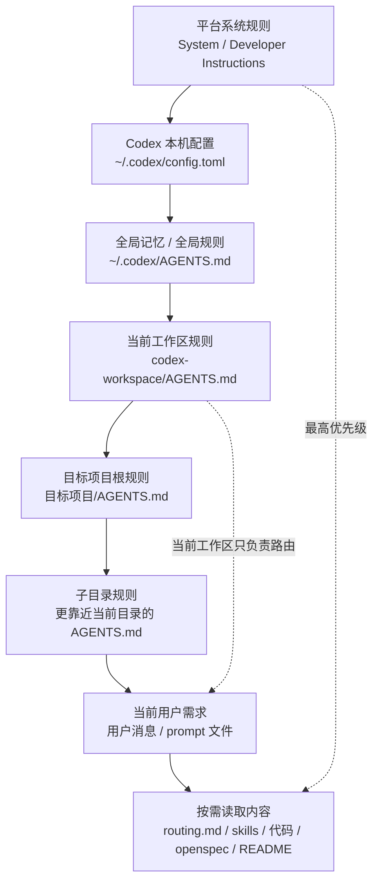
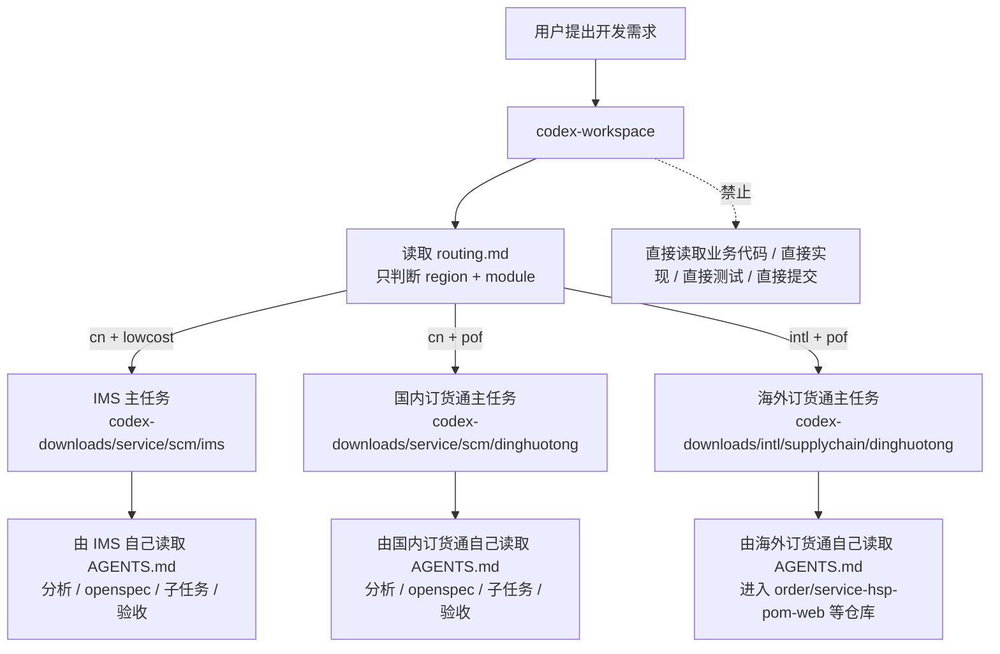
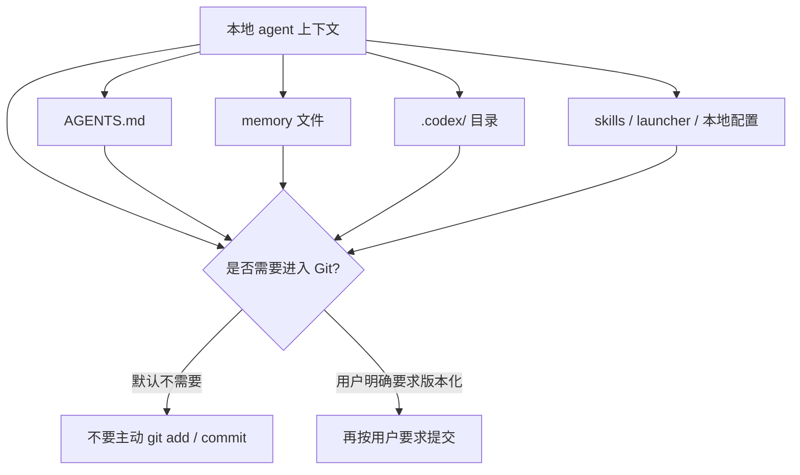
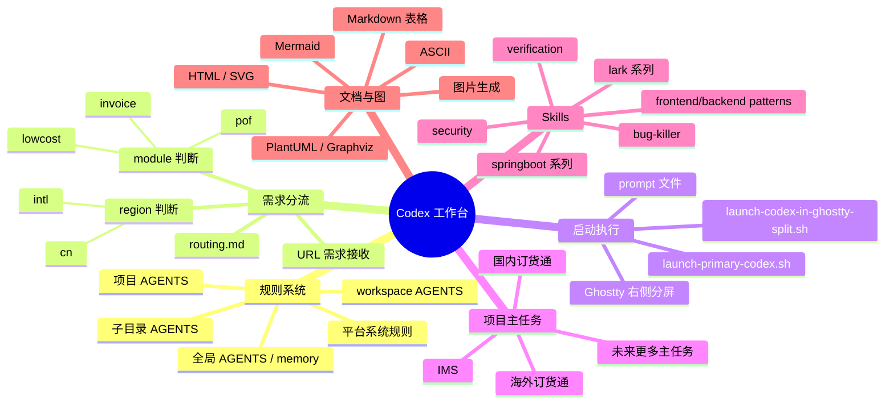
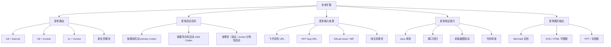
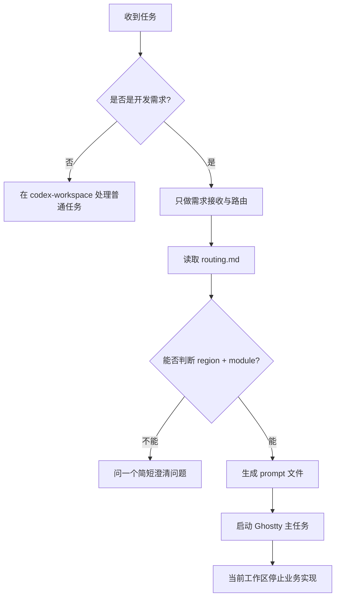

# Codex Agent 能力与读取链路图

这份文档用 Mermaid 汇总当前 `codex-workspace` 已经具备的 agent 能力，以及后续可以扩展进来的能力。

## 1. 规则读取与上下文生效顺序

## 2. 当前开发需求分流链路

## 3. Ghostty 启动器结构

## 4. Agent / Memory / 本地配置的 Git 规则

## 5. 当前已具备能力总览

## 6. 未来可扩展点

## 7. 推荐使用原则

## 摘要

- 待整理。

## 核心内容

- 待补充。

## 可执行动作

- [ ] 待确认。

## 相关链接

- [[Codex 启动加载顺序]]
- [[0、Codex CLI 本质架构]]
- [[1、skill是什么]]
