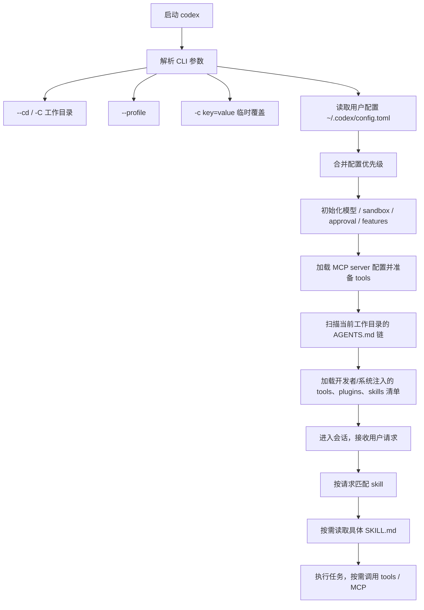
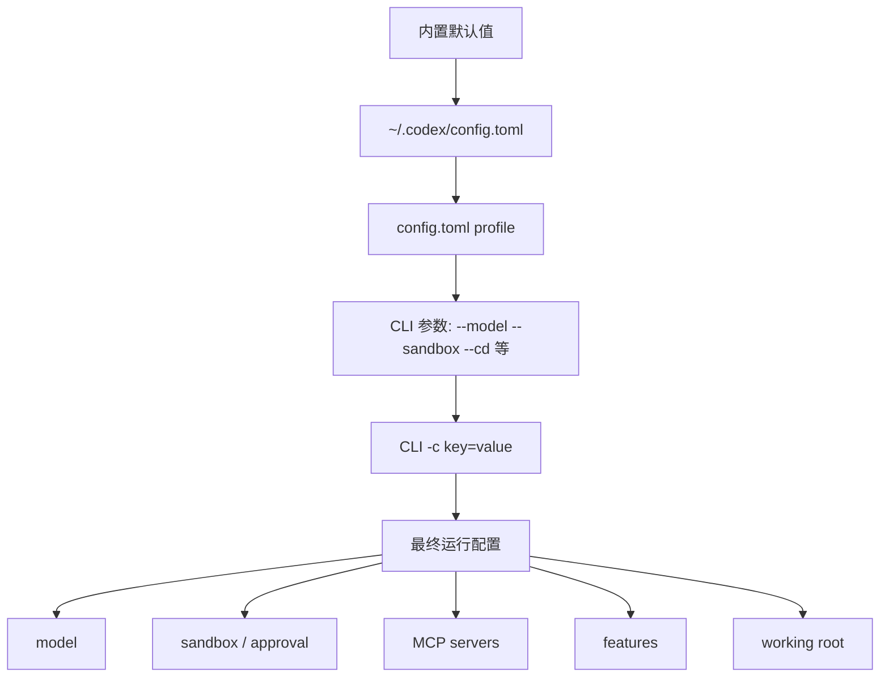
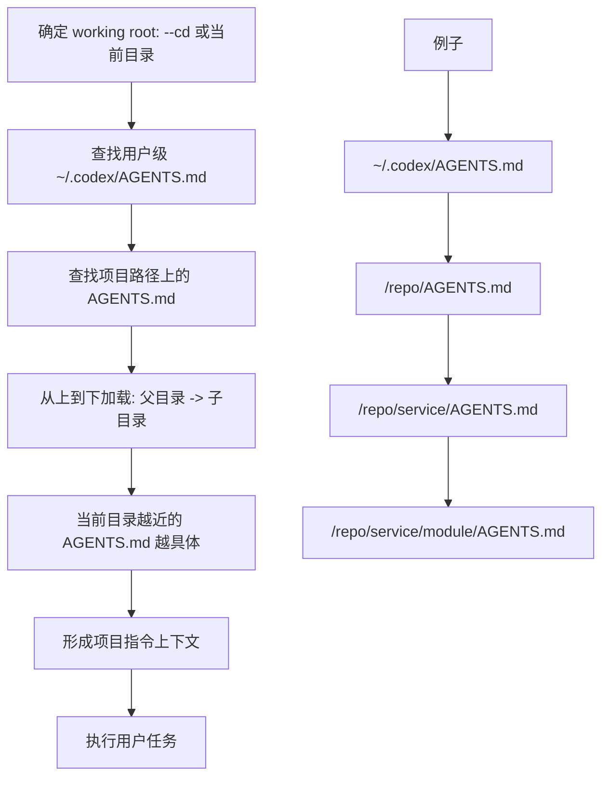
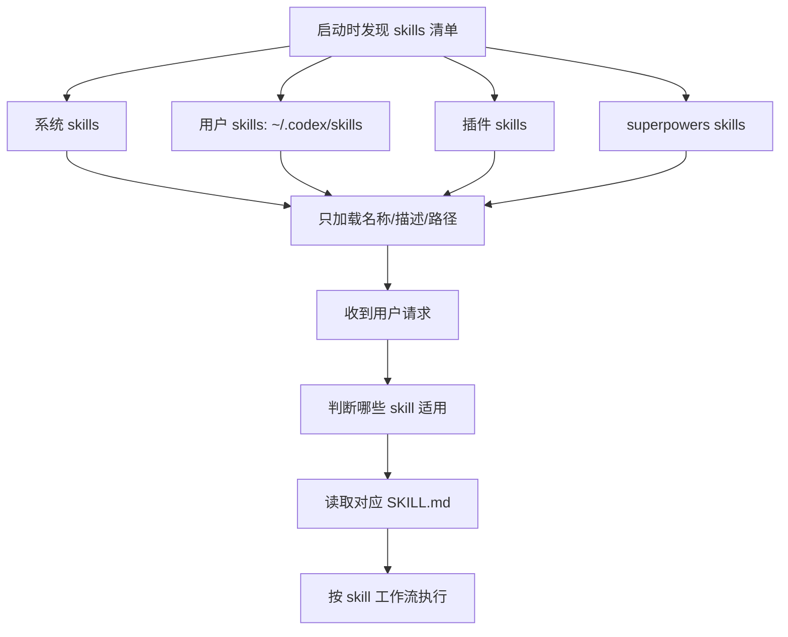
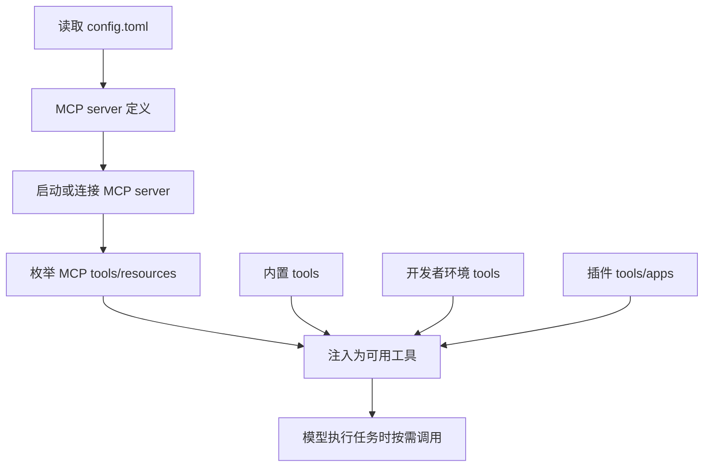

# Codex启动时会读取什么

本文按“在一个具体项目目录启动 Codex，并且 config、AGENTS、skills、tools、MCP、plugins 都存在”的场景整理。

## 总启动顺序



## 配置优先级



配置一般按“越晚越具体越优先”理解：

```text
内置默认值 < ~/.codex/config.toml < profile < CLI 参数 < -c 覆盖
```

如果相同字段重复，后面的覆盖前面的。

## AGENTS.md 加载流程



如果多层 `AGENTS.md` 有相同要求：

- 更具体目录的 `AGENTS.md` 用来细化当前目录行为。
- 不能覆盖更高优先级的 system/developer 指令。
- 同类冲突时，通常按“更靠近当前工作目录、更具体”的规则执行。
- 如果两个规则直接矛盾，不能可靠合并时应按更高优先级执行，必要时问用户。

## Skill 加载流程



Skill 不是启动时全部读正文。一般是启动时可见“清单”，真正任务触发时才读取具体 `SKILL.md`。

同名 skill 的规则：

```text
Personal skills override superpowers skills when names match
```

也就是：

```text
~/.codex/skills/<name> 优先于 ~/.codex/superpowers/skills/<name>
```

插件 skill 通常带前缀，比如 `browser-use:browser`，用于避免和普通 skill 撞名。

## Tool / MCP 加载流程



概念区别：

- `tool`：Codex 可调用的能力入口，比如 shell、apply_patch、browser、MCP 暴露的工具。
- `MCP`：一种工具提供方式。MCP server 启动后，把它的 tools/resources 暴露给 Codex。
- `skill`：说明“什么时候、按什么流程做事”，不是工具本身。
- `AGENTS.md`：项目/目录级长期指令。
- `config.toml`：Codex 本机运行配置，决定模型、sandbox、MCP、profiles 等。

## 最终优先级总览

```text
System 指令
> Developer 指令
> 当前会话工具/环境约束
> ~/.codex/config.toml + CLI 覆盖
> ~/.codex/AGENTS.md
> 项目父级 AGENTS.md
> 项目子级 AGENTS.md
> Skill 工作流
> 用户当前请求
```

用户请求可以决定“做什么”，但不能覆盖更高层安全、工具、项目约束。Skill 决定“怎么做”，也不能覆盖 system、developer、AGENTS 的硬性规则。

## 摘要

- 待整理。

## 核心内容

- 待补充。

## 可执行动作

- [ ] 待确认。

## 相关链接

- [[Codex启动时会读取什么]]
- [[Codex agent会读取哪些上下文]]
- [[Skill放在哪里以及怎么维护]]
- [[Obsidian笔记怎么写]]
