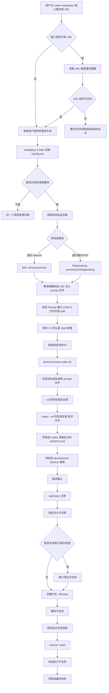
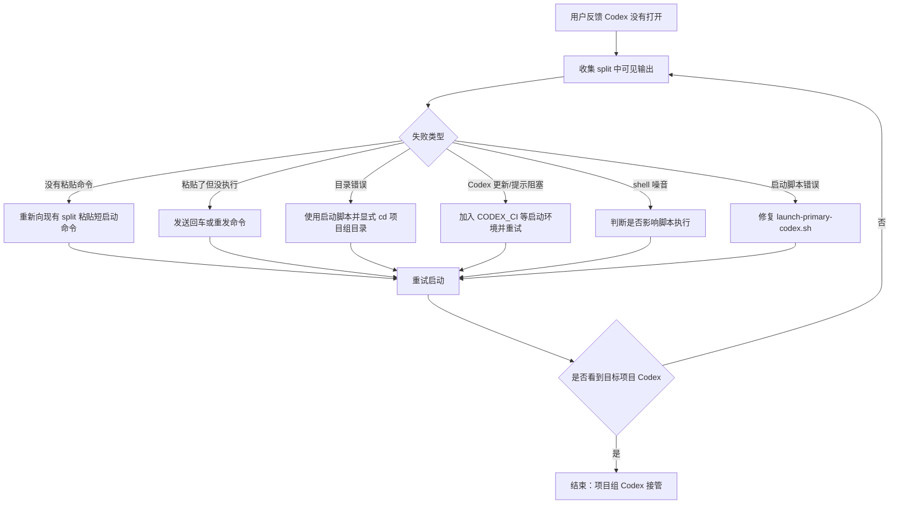

# Workspace Onboarding Rule

进入目录时：

1. 如果根目录 `AGENTS.md` 声明了 `Workspace Type`，直接遵守。
2. 如果没有 workspace type，先简要检查目录。
3. 只问一次：`这是已有项目、新项目，还是杂事空间？`
4. 用户回答后，创建或更新根目录 `AGENTS.md`，写入 workspace type 和 entry rules。
5. 后续会话遵守根目录 `AGENTS.md`，除非用户明确要改变类型。

## Workspace Types

### Existing project

- 使用项目 `AGENTS.md`。
- 持久知识放在项目 `docs/`、`openspec/` 或 `.codex/`。

项目 memory 读取规则：

1. 先读取项目根目录 `AGENTS.md`。
2. 如果项目存在 `.codex/backend_develop_agents.md` 或其他职责明确的项目 agents 文档，在代码分析或实现前继续读取相关文档。
3. 如果项目存在 `.codex/memories/`，检索并读取与当前需求、模块、服务、路由、分支或错误相关的 memory。
4. 项目 memory 是项目规则的补充；冲突时优先级为：用户最新指令 > 根 `AGENTS.md` > 项目 `.codex/*_agents.md` > 相关项目 `.codex/memories/*.md` > 用户级 `~/.codex/memories/*.md`。
5. 如果形成可复用的项目经验，优先沉淀到项目 `.codex/memories/`，而不是用户级 memory。

### New project

- 先明确目标和约束。
- 创建项目结构、根目录 `AGENTS.md` 和 `docs/project-brief.md`。

### Miscellaneous workspace

- 不假设这是软件项目。
- 不主动写入项目 docs，除非用户明确要求。

推荐杂事目录：

```text
/Users/heytea/Documents/HeyTea/codex-workspace
```

避免使用 `code`、`project`、`repo` 这类泛名作为杂事空间。

## 跨项目开发协作底线

这些规则适用于所有已有项目，不限于某个业务线或仓库。

### 操作前说明

- 执行具体操作前，先说明当前步骤、目的和预期影响。
- 需要人工复核时，优先展示可核对的 `git diff`、命令输出或文件片段，不只给结论摘要。

### 分支规则

- 创建或切换特性分支前，必须先和用户确认来源分支与目标分支名。
- 默认从主干分支创建特性分支；创建前必须先同步远程主干，例如先 fetch/pull 最新 `origin/master`，再基于最新主干创建新分支。
- 分支命名应参考项目历史分支风格，并尽量包含需求编码和需求名称。
- 如果需求编码缺失，至少包含区域或模块、变更类型和业务对象。
- 允许在用户明确确认后提交和推送特性分支。

### 主干与 MR/PR 底线

- 禁止自行创建 MR/PR。
- 禁止自行合并到 `master` 或其他主干分支。
- 禁止推动任何进入主干的流程。
- 合并、提 MR/PR、指定评审人、进入主干等动作必须由用户或团队按内部流程处理。

### 无效代码清理边界

- 修改代码时，可以清理本次改造引用链内暴露出的无效代码，例如无用 import、明显不可达分支或已失效的局部辅助逻辑。
- 清理范围必须限制在当前服务、本次触碰的调用链或引用链内。
- 不做跨模块、跨服务、无关文件的泛化清理，避免产生与需求无关的 diff。

## Workspace 需求路由与 Ghostty 启动规则

当我在 `codex-workspace` 中告诉 Codex「有一个需求要做」时，workspace 里的 Codex 只负责路由和启动项目组主任务。

### Capability 路由补充规则

除了判断 `region` 和 `module`，workspace Codex 还必须判断 `capability`，并把它传给 primary task：

```text
region=<cn|intl>
module=<module>
capability=<backend_development|fix_bug|testing|frontend_development|unknown>
primary_workspace=<path>
```

能力判断：

- `backend_development`：后端 Java 服务开发、接口契约改造、OpenSpec 支撑的服务改造、model/facade/controller/client 改造或普通功能实现。
- `fix_bug`：用户明确提到 bug、fix bug、修 bug、故障、报错、traceId、日志、异常、线上问题、regression，或要求排查/修复既有错误行为。
- `testing`：测试设计、测试执行、回归验证、覆盖率、自动化测试建设且不以生产代码实现为主。
- `frontend_development`：前端页面、UI、客户端实现。
- `unknown`：无法判断时传 unknown，由 primary task 在实现前澄清。

它不负责：

- 继续分析业务细节。
- 读取服务代码。
- 维护项目 `openspec/`。
- 创建分支。
- 编码。
- commit / push。
- 做业务验收。

它负责：

1. 根据需求文本识别区域和业务模块。
2. 找到对应的项目组总目录。
3. 在当前 Ghostty 窗口右侧打开 split。
4. 在新 split 中进入项目组总目录并启动新的 Codex。
5. 把需求文本传给新的项目组 Codex。
6. 后续由项目组 Codex 按自己的 `AGENTS.md` 和 development harness 执行。

### URL 需求入口

我可能不会直接描述需求，而是只给一个 URL。

这种情况下，workspace Codex 不能直接根据 URL 猜需求，也不能只把 URL 丢给项目组 Codex。它需要先读取 URL 中的需求内容，再进行路由。

需要提取的信息：

- 需求编码或工单号。
- 需求标题。
- 业务背景。
- 涉及模块或服务线索。
- 具体变更点。
- 验收标准。
- 关键附件或关联文档。

读取规则：

- 飞书/Lark 文档：优先使用对应 `lark-*` 能力读取。
- HHT/bug 平台：优先使用 `bug-killer` 相关脚本或流程。
- 内部网页：只读取理解需求所需的信息；如需 SSO/VPN，则按现有登录能力处理。
- GitLab URL：先判断是 group、repo、issue、merge request 还是代码文件，再决定是否可路由。

如果 URL 无法访问：

- 不要编造需求。
- 不要只根据 URL 路径强行路由。
- 应要求我提供访问权限、登录条件、VPN，或直接粘贴需求正文。

如果 URL 能访问：

1. 先形成一段简洁需求摘要。
2. 再根据摘要和路由表判断项目组。
3. 启动项目组 Codex 时，把原 URL 和需求摘要一起传给它。

### 当前路由

| 需求信号 | 项目组目录 | 说明 |
| --- | --- | --- |
| 国内 lowcost、低耗、低值易耗、费用化 | `/Users/heytea/Documents/HeyTea/code/codex-downloads/service/scm/ims` | IMS 主任务接管 |
| 国内履约、订货通履约、POF、履约单 | `/Users/heytea/Documents/HeyTea/code/codex-downloads/service/scm/dinghuotong` | 订货通主任务接管 |

路由表：

```text
/Users/heytea/Documents/HeyTea/code/codex-downloads/module-index/routing.md
```

workspace 入口规则：

```text
/Users/heytea/Documents/HeyTea/codex-workspace/AGENTS.md
```

启动脚本：

```text
/Users/heytea/Documents/HeyTea/codex-workspace/.codex-launchers/launch-primary-codex.sh
```

### 启动方式

不要直接把完整的 `codex --cd ... "<中文需求>"` 长命令粘贴进 Ghostty。更稳定的方式是：

1. 先把需求写入 prompt 文件。
2. 在当前 Ghostty 窗口右侧打开 split。
3. 在 split 中执行一个短命令。
4. 短命令调用启动脚本。
5. 启动脚本负责进入项目组目录并执行 Codex。

启动脚本行为：

```bash
cd <项目组总目录>
export CODEX_CI=1
export CODEX_MANAGED_BY_NPM=1
codex --cd <项目组总目录> "<需求文本>"
```

### Mermaid 流程图



### 国内履约示例命令

```bash
prompt_file="/Users/heytea/Documents/HeyTea/codex-workspace/.codex-launchers/p23_1234-cn-pof-es-mq-log.prompt"
printf '%s\n' '需求 p23_1234：履约单新增发送 ES 的 MQ 的日志。请按项目级 development harness 处理；如果当前 group 尚未实例化 harness，请先采用通用 harness 并创建必要的项目级 AGENTS/openspec 规则。不要直接改代码，不要 commit/push，先做需求确认和 openspec。' > "$prompt_file"

printf '%s' "/Users/heytea/Documents/HeyTea/codex-workspace/.codex-launchers/launch-primary-codex.sh /Users/heytea/Documents/HeyTea/code/codex-downloads/service/scm/dinghuotong $prompt_file" | pbcopy

osascript \
  -e 'tell application "System Events"' \
  -e 'set frontApp to name of first application process whose frontmost is true' \
  -e 'if frontApp is not "ghostty" and frontApp is not "Ghostty" then error "当前前台应用不是 Ghostty，无法定位同窗口 split"' \
  -e 'keystroke "d" using command down' \
  -e 'delay 1.5' \
  -e 'keystroke "v" using command down' \
  -e 'delay 0.2' \
  -e 'key code 36' \
  -e 'end tell'
```

### 失败处理

如果新 split 只打开 shell，没有进入 Codex：

1. 看 split 中是否已经粘贴了 `launch-primary-codex.sh ...` 短命令。
2. 如果没有，手动执行最近一次 prompt 对应的短命令。
3. 如果 `.zshrc` 报某个 completion 文件缺失，例如 `openclaw.zsh`，这通常是 shell 配置问题，不代表 Codex 启动脚本失败。

### 启动失败后的持续修复规则

如果我说了需求后，workspace Codex 尝试打开项目组 Codex 失败，我再回来找它，workspace Codex 不能只给我一条手动命令就结束。

它必须进入启动修复循环，直到：

- 目标项目组 Codex 成功打开；或
- 遇到明确的、无法自动恢复的阻塞，并说明具体原因。

启动修复循环：



判断成功的标准：

- 新 split 中已进入 Codex 对话界面。
- 新 Codex 工作目录是目标项目组目录。
- 新 Codex 读取的是目标项目组 `AGENTS.md`，例如 IMS 或 Dinghuotong 的 `AGENTS.md`。

如果自动化无法直接观察 split 状态，workspace Codex 可以让我贴出 split 中最后几行输出，但它仍然负责继续诊断和重试。

## 摘要

- 待整理。

## 核心内容

- 待补充。

## 可执行动作

- [ ] 待确认。

## 相关链接

- [[Codex 工作台]]
- [[1、什么是openspec]]
