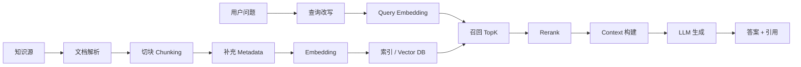

# 1、什么是rag
## RAG 不是什么

- 不是微调：RAG 不改变模型参数。
- 不是模型长期记忆：资料只在当前请求的上下文中生效。
- 不是万能搜索：召回错了，后面生成再强也很难补救。
- 不是 Agent 本身：RAG 查资料，Agent 决定什么时候查、查什么、查几次。

RAG 是 Retrieval-Augmented Generation 的缩写，中文一般叫：
> 检索增强生成

它本质上是：

> “让大模型在回答前，先去查资料，再结合资料生成答案。”
# 2、为什么需要rag

LLM 的局限：

- 知识有截止时间，无法知道最新信息。
- 上下文窗口有限，不能塞下所有知识。
- 可能生成看似合理但不准确的幻觉。
- 无法天然访问企业内部文档、代码库和私有数据。

RAG 的作用：

- 从外部知识库实时检索相关信息。
- 把检索结果作为上下文注入 LLM。
- 基于真实文档回答，减少幻觉。
- 提供引用来源，便于验证。
- 避免频繁微调或重训练。


### RAG 与 Agent

- RAG 本身是检索增强生成链路。
- Agent 可以把 RAG 当作一个工具，在需要查资料时调用。
- LLM 不一定知道“自己在用 RAG”，它只看到被拼接进上下文的资料。


RAG（Retrieval-Augmented Generation，检索增强生成）本质上是：

> “让 LLM 在回答前，先去查资料，再基于资料回答。”

它解决的是：

> 大模型“脑子里没有、记不准、上下文太短、知识过时”的问题。

你可以把它理解为：

- GPT 本身 = 一个“会推理的大脑”
    
- RAG = 给这个大脑外挂“资料库 + 搜索系统”


# 3、rag怎么使用

### 一句话理解

```text
用户问题 -> 检索相关资料 -> 构建上下文 -> LLM 基于资料生成答案
```

RAG 的本质是动态补上下文。模型本身没有“记住”这些资料，只是在当前请求里看到了检索结果。


### 适合解决的问题

| 问题     | RAG 的作用               |
| ------ | --------------------- |
| 模型知识截止 | 用外部知识源实时更新            |
| 企业私有知识 | 接入文档、代码库、知识库、数据库导出等资料 |
| 幻觉     | 要求模型基于可引用资料回答         |
| 上下文有限  | 只检索和当前问题相关的片段         |
| 不想频繁微调 | 通过更新知识库而不是训练模型更新知识    |

# 4、rag整体流程

标准 RAG 架构一般长这样：

```text
                ┌──────────────┐
                │ 用户问题      │
                └──────┬───────┘
                       ↓
             ┌──────────────────┐
             │ Query Rewrite     │
             │ 查询改写/扩展      │
             └──────┬───────────┘
                    ↓
        ┌────────────────────────┐
        │ Embedding 向量化        │
        └──────────┬─────────────┘
                   ↓
     ┌─────────────────────────────┐
     │ Vector DB 向量数据库         │
     │ Pinecone / Milvus / ES      │
     └──────────┬──────────────────┘
                ↓ TopK召回
      ┌────────────────────────┐
      │ Retriever 检索器        │
      └──────────┬─────────────┘
                 ↓
      ┌────────────────────────┐
      │ Reranker 重排序         │
      └──────────┬─────────────┘
                 ↓
      ┌────────────────────────┐
      │ Prompt Builder          │
      │ 拼接上下文              │
      └──────────┬─────────────┘
                 ↓
         ┌────────────────┐
         │ 大模型 LLM      │
         └────────────────┘
```

完整链路：

```text
                【离线阶段】
企业文档
   ↓
文档解析
   ↓
文档清洗
   ↓
Chunk切块
   ↓
Embedding向量化
   ↓
存入向量数据库

================================================

                【在线阶段】
用户问题
   ↓
Query改写
   ↓
Query Embedding
   ↓
向量检索
   ↓
召回TopK Chunk
   ↓
重排序（Rerank）
   ↓
Prompt组装
   ↓
LLM生成
   ↓
最终回答
```


	## RAG 分为两条链路：离线索引链路和在线问答链路。

## 核心内容

### 全链路



### 离线索引链路

离线链路解决“资料如何进入知识库”：

| 环节        | 关键问题                    |
| --------- | ----------------------- |
| 文档解析      | 原始资料是否被准确抽取成文本、表格、标题和层级 |
| 清洗        | 是否去掉页眉页脚、广告、重复段落和无效噪声   |
| 切块chunk   | chunk 是否保留完整语义，是否过短或过长  |
| 元数据       | 是否保留来源、路径、权限、时间、业务域和版本  |
| Embedding | 是否使用适合语言、领域和长度的向量模型     |
| 建索引       | 是否支持向量检索、关键词检索、过滤和增量更新  |

### 在线问答链路
在线链路解决“问题如何找到资料并生成答案”：

| 环节         | 关键问题                 |
| ---------- | -------------------- |
| 查询理解       | 用户问题是否需要改写、拆分或补充同义词  |
| 初召回        | 是否用向量、关键词或混合检索拿到候选资料 |
| 过滤         | 是否按权限、业务域、时间、来源做过滤   |
| 重排         | 候选资料是否按和问题的真实相关性重新排序 |
| Context 构建 | 是否在 token 预算内保留最有用证据 |
| 生成         | 模型是否严格基于证据回答，并给出引用   |

### 最容易出问题的地方

- 文档解析失败：表格、标题、代码块、图片 OCR 丢失，后面全链路都会受影响。
- chunk 切错：语义被切断，召回到的片段缺上下文。
- 元数据缺失：无法按权限、版本、业务线、文档类型过滤。
- 召回不准：正确 chunk 没进候选集，后面 rerank 和生成都很难补救。
- Context 污染：无关 chunk 被放进上下文，模型会被错误证据带偏。

# Hybrid Search（现代主流）
企业里：
纯向量搜索通常不够。
因为：
Embedding 不擅长：
- ID
- 单号
- 精确字符串
例如：
```text
DH00081720251222000001
```

所以：
现代 RAG：
一般：
## 混合检索
即：
同时：
- BM25（关键词）
- Embedding（语义）
## 为什么 Hybrid 更强
例如：
用户问：
```text
SC单据税码同步失败
```
可能：
- “SC单据”需要关键词
- “税码同步失败”需要语义

# Rag真正先进架构：

```
Document Layer
↓
Parsing Layer
↓
Chunk Layer
↓
Embedding Layer
↓
Retrieval Layer
↓
Rerank Layer
↓
Context Assembly
```

每层独立。
这样：
- embedding 可替换
- OCR 可升级
- rerank 可升级
- chunk 可重建
这才是真正企业级 AI Infra。