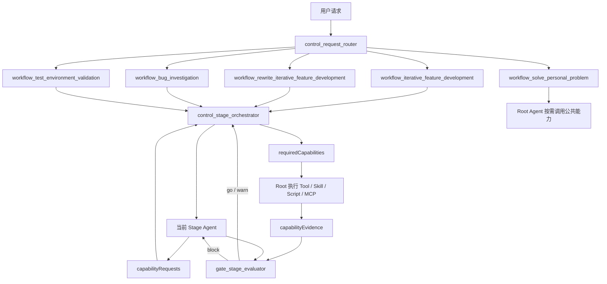

# 最新multi-agent流程总览

## 摘要

五个 Workflow 共用 Router、Orchestrator、Stage、Capability 和 Gate。正式需求和调查通过 `openSpecContext` 保持对象身份，通过 Root 执行能力后再由 Gate 判断证据。

## 核心流程

## Workflow

| Workflow ID | 场景 | 主链 |
| --- | --- | --- |
| `workflow_iterative_feature_development` | 常规后端迭代，也覆盖项目初始能力 | 产品 -> 设计 -> 用例 -> 编码 -> CR -> 本地测试 -> 交付 |
| `workflow_rewrite_iterative_feature_development` | 遗漏需求或已有 `bug-list.md` 的续改 | 设计 -> 用例 -> 编码 -> CR -> 本地测试 -> 重新交付 |
| `workflow_bug_investigation` | 问题描述、异常或 traceId 排查 | 证据收集 -> 源码链路分析 -> 结论；不改代码 |
| `workflow_test_environment_validation` | 交付后的测试环境验证 | 版本确认 -> 数据准备 -> Pod curl -> 结果核验 -> 归档 Gate 或 Bug 清单 |
| `workflow_solve_personal_problem` | 本地配置、浏览器、知识维护、个人自动化 | Root Agent 使用最小能力，不强制 Stage 链 |

本地单独测试和单独交付不是新 Workflow，分别从 `stage_test_runner` 和 `stage_version_delivery` 进入迭代 Workflow。

## 相关链接

- [[my-multi-agents总览]]
- [[当前运行架构和统一流程]]
- [[Multi-Agent与OpenSpec边界]]
