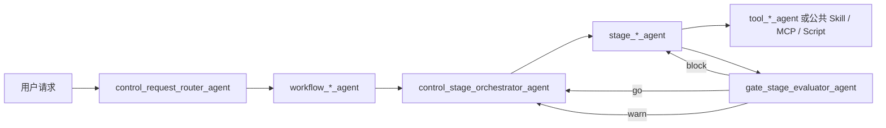

# 最新multi-agent流程总览

## 摘要

当前目标架构不是一条固定的五类直线，而是五类 Agent 的协作模型：

```text
control -> workflow -> stage -> tool
                    -> gate
```

其中 Router 只选择 Workflow，Orchestrator 负责执行 Workflow 的状态机，Stage Agent 对阶段结果负责，Tool Agent 提供受治理的原子能力，Gate Agent 只判断能否进入下一阶段。

所有本地 Agent 统一使用：

```text
<layer>_<responsibility>_agent
```

## 总流程



## 四个 Workflow Agent

| Agent | 适用场景 | 顺序约束 |
| --- | --- | --- |
| `workflow_iterative_feature_development_agent` | 常规迭代开发，包括项目初始版本 | 严格 |
| `workflow_rewrite_iterative_feature_development_agent` | 基于历史实现继续改造或重做现有迭代 | 严格 |
| `workflow_bug_investigation_agent` | 先取证、定位根因，再决定是否修复 | 严格 |
| `workflow_solve_personal_problem_agent` | 本地配置、知识维护、浏览器操作、个人自动化等 | 按任务动态编排 |

## 开发职责 Stage Agent

| Agent | 核心交付物 |
| --- | --- |
| `stage_product_owner_agent` | 清晰、可验收的需求范围与闭环问题 |
| `stage_backend_designer_agent` | 后端改动点、接口和数据设计、风险与回归面 |
| `stage_backend_developer_agent` | 后端实现、单元测试和可复现验证结果 |
| `stage_frontend_developer_agent` | 按确认文案、交互和接口契约实现前端 |
| `stage_test_case_designer_agent` | 独立测试用例、数据准备和回归逻辑 |
| `stage_code_reviewer_agent` | 独立 CR 结论、问题清单和剩余风险 |
| `stage_test_runner_agent` | 本地服务/Docker/跨服务联调、正式测试证据 |
| `stage_version_delivery_agent` | 权限、依赖、部署、流水线、观察和归档闭环 |

Bug 排查流程可使用 `stage_investigation_planner_agent`，但它不属于上述开发职责清单。

## 关键规则

- Workflow Agent 定义阶段顺序和完成条件，不亲自执行各阶段工作。
- `control_stage_orchestrator_agent` 是流程状态机，不是第二个 Router。
- `gate_stage_evaluator_agent` 只读已有交付物并输出 `go`、`warn` 或 `block`。
- `stage_test_runner_agent` 的成功标准是业务链路闭环证据，不是“Docker 已启动”。
- `stage_version_delivery_agent` 必须先解析本次需要 deploy 的具体服务，不能把“存在流水线”当成“已交付”。
- 当前文档是目标设计；实际启用状态另见 [[目标agent落地状态]]。
