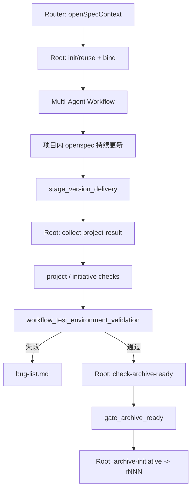

# Multi-Agent与OpenSpec边界

## 摘要

两套系统独立，不让每个 Stage 双写中央仓库；通过统一 `openSpecContext`、Root 执行的中央 CLI 和 Gate 消费的执行证据连接。

## 核心内容

| 位置 | 职责 |
| --- | --- |
| 项目内 `openspec/` | 开发期间唯一持续更新的服务级事实 |
| 中央 `projects/<projectKey>/standards/` | 一个项目共用的规范 |
| 中央 `initiatives/_shared/<initiativeKey>/` | 一个需求唯一的跨项目协调对象 |
| 中央 `initiatives/<projectKey>/<initiativeKey>/binding.yaml` | 项目、服务、分支、Commit 和证据绑定 |
| 中央 `investigations/` | 与需求号解耦的问题调查 |
| 中央 `archive/.../revisions/rNNN/` | 从精确 Commit 生成的不可变快照 |

`openSpecContext` 在 Router、Orchestrator、所有 Stage 和 Gate 之间原样传递。Control 和 Gate 不拼接或执行 Shell；Root 从公共能力矩阵解析 `central-openspec-cli`，执行结构化 operation/args，并记录 JSON、退出码和产物路径。

Stage 只返回 `capabilityRequests`；Orchestrator 校验并归并请求；Root 执行并回填 `capabilityEvidence`。Product Owner 和 Bug Investigator 只返回中央叙述性文档内容，由 Root 持久化。

中央 OpenSpec 重命名或迁移时，Router、Orchestrator 和 Root 必须先读取中央仓库根目录的 `move-guidence.md`，并保留 Git 状态、运行时引用和迁移后校验证据。

## 可执行动作

- 运行 `python3 ~/.codex/agent-catalog-runtime/check_openspec_bridge.py` 检查活跃 Agent、公共能力和中央 workspace。
- 交付后按 `collect -> project/initiative checks -> test environment -> archive-ready -> archive` 顺序收口。

## 相关链接

- [[当前运行架构和统一流程]]
- [[Workflow路由和使用方式]]
- [[开发流程Gate规则]]
- [[my-openspec总览]]
- [[my-openspec与Multi-Agent串联及迁移]]

中央仓库不保存凭据、生产数据、本机 checkout 路径或可变运行状态；项目快照必须来自 Binding 中记录的完整 Commit SHA。
