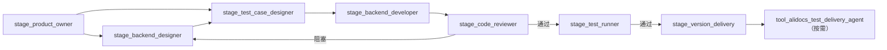

# 当前运行架构和统一流程

## 摘要

本机采用 Control、Stage、Tool、Gate 四层 Agent，Workflow 是 Orchestrator 使用的状态机，公共能力不自动成为 Agent。

## 分层

| 类型 | 是否注册 Agent | 职责 |
| --- | --- | --- |
| `control_*` | 是 | Router 选流程；Orchestrator 持有流程状态 |
| `workflow_*` | 否 | 定义阶段顺序、入口、回退和完成条件 |
| `stage_*` | 是 | 对一个专业阶段和产物负责 |
| `tool_*_agent` | 按需注册 | 为需要独立治理契约的具体操作提供稳定入口；当前为 AliDocs 提测文档 |
| 公共能力 | 否 | 通过 Skill、Script 或 MCP 执行具体操作 |
| `gate_*` 规则 | 否 | 描述某个放行条件 |
| `gate_stage_evaluator` | 是 | 对一个 Gate 规则输出 `go / warn / block` |

## 两个 Control 为什么不重复

`control_request_router` 只在入口回答“选哪个 Workflow、从哪里进入”；`control_stage_orchestrator` 在整个任务期间回答“当前在哪一步、下一步是谁、失败回哪里”。前者无长状态，后者持有状态机。

## 开发主链

Stage、Tool Agent 和公共能力只返回结果；只有 Orchestrator 推进 Workflow；Gate 不执行修复。Tool Agent 不取代 Stage，只治理一个具体操作。

## 相关链接

- [[最新multi-agent流程总览]]
- [[当前agent注册表]]
- [[xuetao-library总览]]
