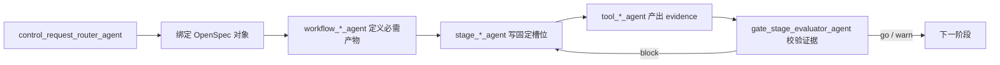

# OpenSpec证据链怎么用

## 摘要

OpenSpec 不是第六层 Agent，而是 Workflow 和 Stage 共用的产物与证据规范：任务先绑定对象，结论写入固定槽位，事实挂到可复现证据，Gate 再检查产物是否足以放行。

## 四个核心约束

1. **能查的不记**：仓库、表结构、命令和运行态必须现场查询，不塞进长期 prompt。
2. **对象化**：正式需求、调查和插件项目分别进入稳定的对象目录。
3. **固定槽位**：需求、设计、任务、审查、验证和交付写到约定文件，避免平行文档树。
4. **证据化**：事实、推断、待验和决策分别标记，并关联可复现证据与反证条件。

## 与五类 Agent 的关系

| Agent 层 | 使用证据链的方式 |
| --- | --- |
| Control | Router 识别对象类型；Orchestrator 透传对象路径和必需产物 |
| Workflow | 定义每阶段必须填充的槽位和 Gate 规则 |
| Stage | 把专业结论写入固定槽位并登记 claims |
| Tool | 把命令、查询、日志或外部结果落为可复现 evidence |
| Gate | 检查产物、claims、证据和待验项是否满足放行条件 |



## 推荐槽位

| 阶段 | 推荐产物 |
| --- | --- |
| 产品澄清 | `requirement.md` |
| 技术设计 | `design.md`、`tasks.md` |
| 测试设计 | `test-cases.md` |
| 代码审查 | `review.md` |
| 调查 | `findings.md` |
| 测试执行 | `verification.md` |
| 版本交付 | `delivery.md` |
| 证据 | `artifacts/evidence/`、`claims.yaml` |

## Claims 最小字段

```yaml
id: claim-001
type: fact | inference | pending | decision
statement: string
evidence: []
falsified_by: string
owner: string
status: open | verified | rejected
```

Gate 不要求所有结论都变成事实，但必须阻止“无来源事实”和“没有处理计划的关键待验项”进入下一阶段。

## 边界

- 证据链不替代运行时 Agent 注册。
- OpenSpec 文件不记录本机端口、绝对路径、凭据或容易漂移的启动命令。
- 可从项目 `AGENTS.md` 或机器状态查到的内容保持引用，不重复复制。
- 是否启用证据链由 Workflow 对象类型决定，普通个人任务可以使用轻量产物。
