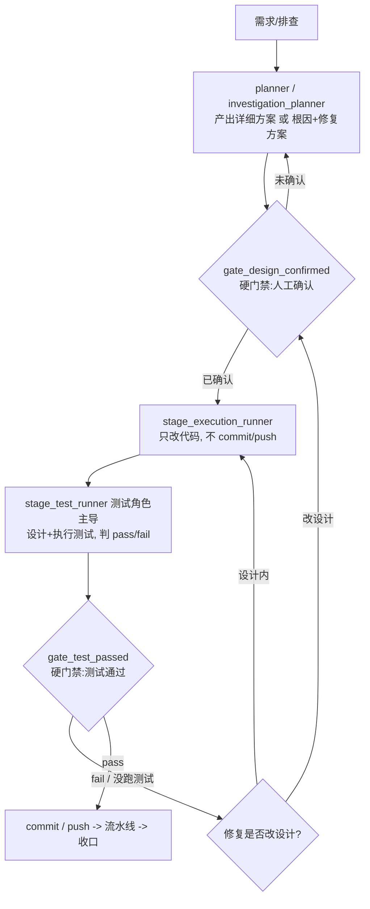

# 开发流程强制门禁改造

## 摘要

之前 agent 走开发流程「很乱」的两个典型症状:

1. 改完代码**直接 commit/push,跳过测试**。
2. 查 bug 时**得出结论就立刻改代码 push,不跟人确认**。

根因(详见排查):控制策略以「减少人工暂停」为目标 + 「懒惰资深开发」人格,而拦它的全是软约束;「测试通过」和「改代码前先对齐」这两个最该卡的点没有硬门禁。

改造做的事:给**所有涉及改代码的开发 role**(新项目开发 / 迭代开发 / 迭代再开发 / 工作中临时发现的 bug 修复)统一加两道**硬门禁**,并新增一个**测试角色 agent** 主导代码后的流程。

## 两道硬门禁

1. **`gate_design_confirmed`** —— 改任何代码之前,必须停下来让人**确认详细方案**(目标、影响文件/服务、接口/数据变更、预期行为、边界、测试计划;bug 还要根因+修复方案)。一句话复述不算确认。方案确认**只授权**建分支和写代码。
2. **`gate_test_passed`** —— 代码写完后,由测试角色 `stage_test_runner` 主导设计+执行测试,给 pass/fail。**测试没过或压根没跑,都禁止 commit/push/流水线**;「没跑测试」和「测试失败」同等对待。

测试失败时:设计内的修复回到「改代码→再测」循环;要改设计/范围/契约的修复,退回 `gate_design_confirmed` 重新确认。

## 新增测试角色

- 新 agent:`stage_test_runner`(已注册进 `~/.codex/config.toml`)。
- 它是代码后阶段的**主导者**:设计测试集(单元/集成/本地闭环)、真跑、记录命令和结果、给唯一裁决 pass/fail。
- 它**自己不 commit/push**——只决定「能不能 push」,动作由执行/工具 agent 在门禁通过后做。
- 涉及库写、定时任务、审批校验、跨服务编排、页面数据行为的改动,要求本地集成/闭环验证,不能只跑代码级测试。

## 这次改了哪些文件

Agent 定义(`~/.codex/agents/`):

- 新增 `stage/stage_test_runner.toml` + 在 `config.toml` 注册
- `gate/gate_stage_evaluator.toml`:加两道硬门禁判定
- `stage/stage_task_planner.toml`:产出详细方案 + 改代码前硬停
- `stage/stage_investigation_planner.toml`:根因→修复方案→人工确认后才改代码
- `stage/stage_execution_runner.toml`:确认前不改代码、代码后交测试角色、测试过前不 push
- `control/control_stage_orchestrator.toml` + `control/control_request_router.toml`:编排新时序 + `will_change_code` 标记

文档(`~/.codex/agents/docs/`):

- `human-control-policy.md`:新增「Mandatory Stops」段,**覆盖**原本「少暂停」的简化条款
- `stage-gates.md`:定义 `gate_design_confirmed` / `gate_test_passed`
- `agent-workflows.md`:三条开发流程时序全部插入两道门禁 + 测试角色
- `agent-registry.md` / `agent-contracts.md` / `four-layer-runtime-map.md`:登记测试角色和新门禁

## 关键点:硬门禁 vs 软约束

这次是把「测试通过」和「改代码前确认」从**软约束(靠模型自觉)** 提升成流程里的**显式门禁节点**,并在最高优先级的策略段落里**覆盖**了原来那些「确认后就不再问、一路 push」的简化条款。但要清醒:这些门禁目前仍是**写进 prompt 让 agent 遵守**,不是脚本物理拦截。要彻底防跳过,下一步可以给 `gate_test_passed` 挂一个真正检查「测试命令+结果证据是否存在」的校验脚本。

## 相关链接

- [[所有agent四层结构和统一流程]]
- [[新旧流程对比-同一件迭代开发]]
- [[OpenSpec证据链怎么用]]
- [[已启用agent怎么用]]
