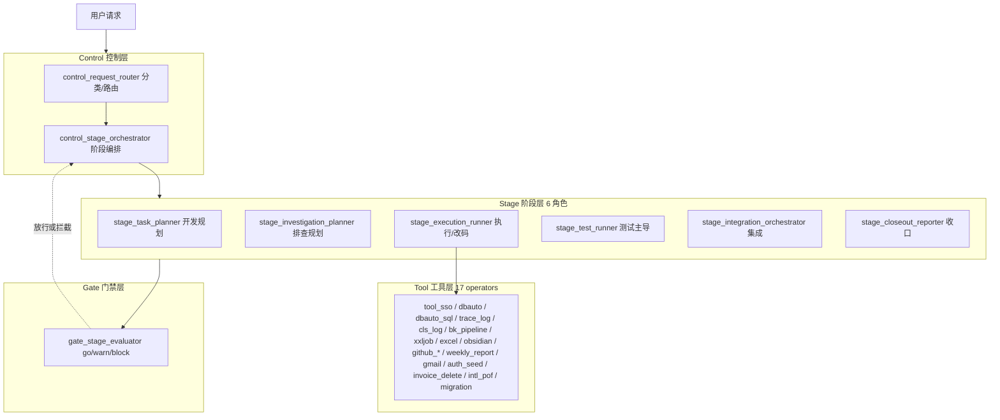
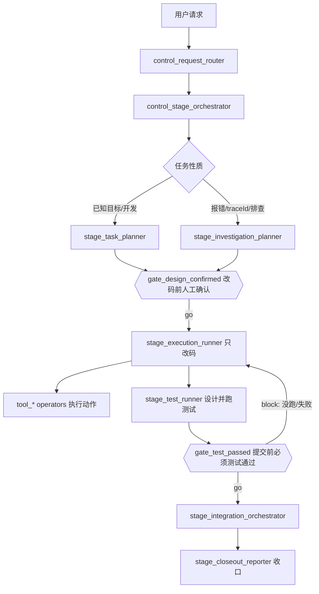
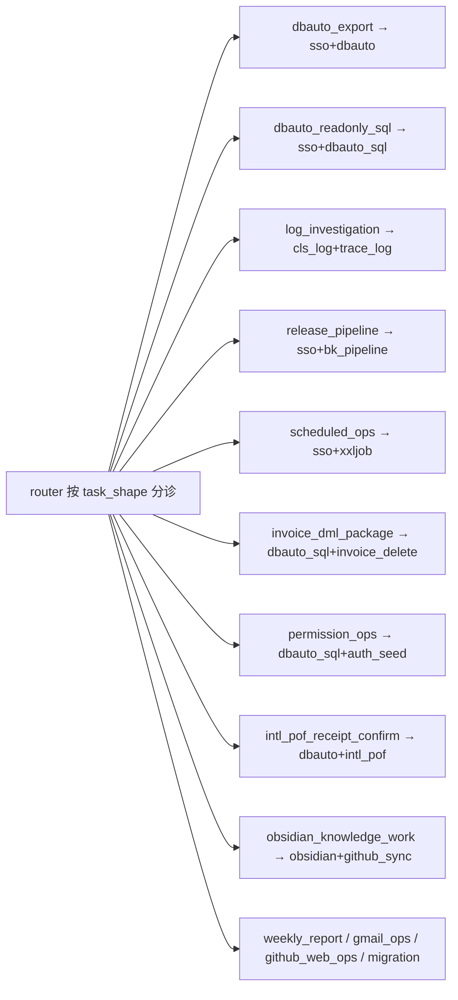

# 我的multi-agent模型总览

## 摘要

当前 multi-agents 模型的运行态现状，直接取自 `~/.codex/config.toml`（运行时真相）。

- 结构：四层 + 单一入口 + 门禁贯穿。控制层分诊 → 阶段层干活 → 工具层执行具体操作 → 门禁层放行/拦截。
- 运行时：模型 `gpt-5.5`(medium)，`max_threads=4`，`max_depth=1`。

| 层 | 数量 | 成员 | 职责 |
|---|---|---|---|
| Control 控制 | 2 | `control_request_router`、`control_stage_orchestrator` | 分类路由 + 阶段编排，决定下一步走谁 |
| Stage 阶段 | 6 | task_planner、investigation_planner、execution_runner、test_runner、integration_orchestrator、closeout_reporter | 真正推进任务的角色 |
| Tool 工具 | 17 | `tool_*` operators | 每个只干一件具体的事 |
| Gate 门禁 | 1 | `gate_stage_evaluator` | 一个评估器，多条门禁规则(go/warn/block) |

## 图 1：四层架构总览

## 图 2：统一运行流（含两道硬门禁）

所有任务默认走的主干；开发类任务的两道硬门禁在此。

## 图 3：控制器怎么路由（按任务形状，不按工具名）

`control_request_router` 先判断 task_shape，再落到对应工具链。现有路由组：

## 门禁规则（一个 gate agent，多条规则）

`gate_stage_evaluator` 按当前阶段套不同规则：

- `gate_design_confirmed` — 改任何代码前，必须人工确认详细方案
- `gate_test_passed` — commit/push/流水线前，test role 必须判定通过（「没跑」=「失败」）
- `gate_execution_ready` / `gate_investigation_ready` / `gate_integration_ready` / `gate_closeout_ready` / `gate_obsidian_sync_ready` — 各阶段就绪校验

## 工具层 17 个 operator（按用途）

- 登录/环境：`tool_sso_operator`、`tool_dbauto_operator`
- 数据查询：`tool_dbauto_sql_operator`
- 日志排查：`tool_cls_log_query_operator`、`tool_trace_log_operator`
- 发布/调度：`tool_bk_pipeline_operator`、`tool_xxljob_execute_once_operator`
- 本地处理：`tool_excel_operator`
- 知识库：`tool_obsidian_operator`、`tool_github_sync_operator`、`tool_github_web_operator`
- 业务专用：`tool_auth_permission_seed_operator`、`tool_invoice_application_full_flow_delete_operator`、`tool_intl_pof_sh_confirm_operator`
- 其它：`tool_weekly_report_operator`、`tool_gmail_classifier_operator`、`tool_personal_migration_curator`

## 和文档落盘的衔接

阶段层角色运行时：**读静态**（`codex-workspace/openspec/` 的 rules/standards/templates），**写动态**（具体服务 `openspec/active/<需求>/iterations/`），收口时把最终版折叠进服务 `specs/`。这套四层 agent 正是文档规范的执行者。

## 相关链接

- [[所有agent四层结构和统一流程]]
- [[开发流程强制门禁改造]]
- [[需求文件夹方案怎么组织]]
- [[本机已启用agent注册表]]
- [[用户说法对应哪个agent]]
