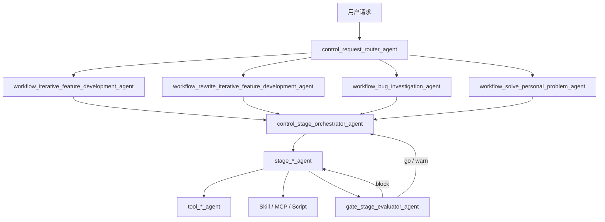
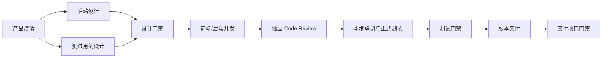

# 所有agent五层结构和统一流程

## 摘要

“五层”表示五类职责，不表示每个请求都必须机械经过五个节点。固定入口是 Router；选中 Workflow 后，由 Orchestrator 根据阶段图调用 Stage、Tool 和 Gate，直到完成、阻塞或取消。

## 结构图



## 五类 Agent

| 层 | 决策范围 | 不负责 |
| --- | --- | --- |
| Control | 请求分类、状态推进、重试、恢复、收口 | 业务设计和工具细节 |
| Workflow | 一类任务的阶段图、顺序、必需产物和 Gate | 亲自执行每个阶段 |
| Stage | 一个阶段的专业判断和交付物 | 改写全局流程 |
| Tool | 单一外部或本地能力的安全执行 | 决定业务是否完成 |
| Gate | 依据规则和证据判定是否放行 | 修复产物或执行操作 |

## 开发主链的最小骨架



这是阶段关系骨架，不是四个 Workflow 的最终逐步定义。某阶段是否跳过必须由 Workflow 条件明确表达，例如无前端改动时不调用前端 Stage。

## 统一状态

Orchestrator 至少维护：

```text
selected_workflow
current_stage
stage_status
required_artifacts
gate_result
retry_count
blocked_reason
resume_from
```

状态只能由 Orchestrator 推进；Stage 和 Tool 返回结果，Gate 返回判定，均不能私自跳阶段。
