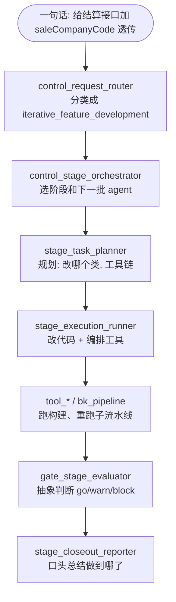
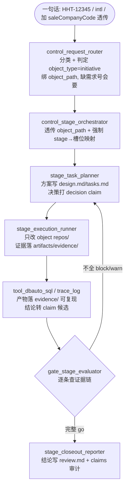

# 新旧流程对比-同一件迭代开发

## 摘要

这篇用**同一件迭代开发的事**，把「改之前」和「改之后」两条流程各推一遍，直观看出证据链纪律到底改变了什么。

- 改之前：四层框架只是**运行引擎**，管「谁做、按什么顺序、何时停」，产物散、结论飘、门禁空转。
- 改之后：引擎不变，但叠加了**内容纪律**——绑对象 → 结论进固定槽位 → 每句话打 claim → 证据可复现 → gate 逐条查证据链才放行。

> 前置背景见 [[OpenSpec证据链怎么用]]；四层结构见 [[所有agent四层结构和统一流程]]。

## 同一件事（示例任务）

> 迭代开发：给订货单结算接口增加 `saleCompanyCode` 透传，改 `manager-hsp-trade`，环境 intl，蓝鲸需求号 HHT-12345。

场景名对应 `iterative_feature_development`（迭代开发）。下面两条流程处理的是**完全相同的这件事**。

## 旧流程（改之前 = 纯运行引擎）

一步步推进：

1. **路由**：识别成「迭代开发」，推荐 planner→runner→pipeline 链。
2. **规划**：planner 说「改 `PmsConvert`，加字段透传，跑构建」。
3. **执行**：runner 改代码、提交、重跑受影响的服务子流水线。
4. **门禁**：gate 说「产物齐全，go」——但**齐不齐没有具体标准，模型自己判断**。
5. **收口**：reporter 在对话里口头总结「已改完、已重跑」。

留下的东西（问题所在）：

- 结论散在对话里，**没有固定文件承载**，下次要复现只能翻聊天记录。
- 「已改完」是事实还是推断？没标。「重跑没报错」多久后要复查？没说。
- trace/SQL 证据（如果查了）散在对话，**不可复现**。
- gate 的「go」是空话，没真查过任何东西。

## 新流程（改之后 = 引擎 + 证据链纪律）

一步步推进（差异用 **粗体**）：

1. **路由**：除了分类成「迭代开发」，还判定这是 **initiative 对象**，绑定 `object_path`；发现只给了一句话没给需求号/环境，**主动补问最小字段**（BlueKing 号 + cn/intl）。
2. **规划**：planner 把方案和范围写进对象的 **`design.md` / `tasks.md`** 固定槽位，「决定改 PmsConvert 透传」被登记成一条 `decision` claim，而不是随口一说。
3. **执行**：runner **只在对象自己的 `repos/` 改代码**；若查了库验证字段来源，SQL 结果落 **`artifacts/evidence/`** 可复现，结论转成带来源的 claim。
4. **门禁**：gate 不再空说「齐了」，而是**逐条查证据链**——`review.md` 在不在、claims.yaml 每条结论有没有 claim、`pending` 有没有 `staleDays`+反证、evidence 文件存不存在。缺一条就 **`block` 打回**。
5. **收口**：reporter 把最终结论写进 **`review.md`**，跑一遍 claims 审计，审计不过不算收口。

## 关键差异对照

| 环节 | 旧流程 | 新流程 |
|---|---|---|
| 任务归属 | 只分类到 stage | 额外绑定 OpenSpec 对象（object_path），缺需求号会要 |
| 方案落点 | 对话里/随意新建 md | 固定槽位 `design.md`/`tasks.md`，禁平行 md |
| 结论落点 | 口头总结 | 写进 `review.md`（investigation 则 `findings.md`） |
| 每句结论 | 事实/猜测混在一起 | 打 `fact/inference/pending/decision` + 来源 + 反证 |
| 工具证据 | 散在对话不可复现 | 落 `artifacts/evidence/` 可复现 + 转 claim |
| 门禁把关 | 抽象「齐了就 go」 | 逐条查证据链完整才 go，否则 block |
| 下次复现 | 翻聊天记录 | 读对象槽位 + evidence 直接复现 |

## 什么时候不触发新纪律

新纪律是 **opt-in**：只有 `object_type != none`（迭代开发、排查、插件这类要留证据链的活）才启用。像**查周报、Gmail 分类、写 Obsidian、dbauto 导出**这种纯操作任务，`object_type = none`，**完全走旧的轻流程**，不会被证据链拖慢。所以是「该严的严、该轻的轻」。

## 相关链接

- [[OpenSpec证据链怎么用]]
- [[所有agent四层结构和统一流程]]
- [[已启用agent怎么用]]
- [[我的agent用例总览]]
