# 新旧流程对比-同一件迭代开发

## 摘要

旧流程的问题不是 Agent 少，而是需求、设计、测试、审查和交付缺少明确所有者，Gate 也没有稳定证据可检查。目标流程用 Workflow 固化顺序、用八个 Stage Agent 交付专业产物、用证据链让 Gate 能独立放行。

## 示例任务

给订货单结算接口增加 `saleCompanyCode` 透传，涉及后端服务和回归验证。

## 旧流程

```text
一句话需求
-> 泛化规划
-> 直接改代码
-> 跑一次构建
-> 口头说明完成
```

主要缺口：

- 没有先确认字段来源、接口契约和兼容范围。
- 测试用例由实现者临时决定，回归面容易漏。
- 没有独立 CR。
- 构建通过被误当成业务链路通过。
- 不明确需要发布哪些依赖、deploy 哪些服务。

## 目标流程

```mermaid
flowchart LR
    R["control_request_router_agent"] --> W["workflow_iterative_feature_development_agent"]
    W --> O["control_stage_orchestrator_agent"]
    O --> P["stage_product_owner_agent"]
    P --> D["stage_backend_designer_agent"]
    P --> TC["stage_test_case_designer_agent"]
    D --> G1["gate_stage_evaluator_agent: design_confirmed"]
    TC --> G1
    G1 --> DEV["stage_backend_developer_agent"]
    DEV --> CR["stage_code_reviewer_agent"]
    CR --> T["stage_test_runner_agent"]
    T --> G2["gate_stage_evaluator_agent: test_passed"]
    G2 --> VD["stage_version_delivery_agent"]
    VD --> G3["gate_stage_evaluator_agent: delivery_closed"]
```



## 产物变化

| 环节 | 目标产物 | Gate 能检查什么 |
| --- | --- | --- |
| 产品 | `requirement.md` | 范围、验收、文案、未决问题 |
| 设计 | `design.md`、`tasks.md` | 接口、数据、风险、依赖与回归面 |
| 测试设计 | `test-cases.md` | 正常、异常、边界和回归覆盖 |
| 实现 | diff、单测、构建证据 | 实现与设计一致，基本验证通过 |
| CR | `review.md` | 阻断问题已处理，剩余风险明确 |
| 测试 | `verification.md` | 业务闭环而非只启动服务 |
| 交付 | `delivery.md` | 依赖、服务、流水线、观察和归档完整 |

## OpenSpec 的作用

OpenSpec 负责固定对象和产物槽位，`claims.yaml` 区分事实、推断、待验和决策，`artifacts/evidence/` 保存可复现证据。它约束产物，不替代五类 Agent。

相关说明：[[OpenSpec证据链怎么用]]、[[八个开发职责agent]]、[[开发流程强制门禁改造]]。
