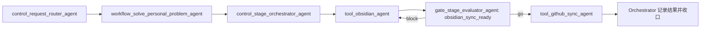

# Obsidian写入和GitHub同步怎么跑

## 摘要

Obsidian 写入与 GitHub 同步属于个人问题 Workflow，不经过后端开发或版本交付 Stage。Orchestrator 先调用本地写入 Tool，验证变更后再经过同步门禁；Git push 属于外部写操作，仍需遵守确认边界。

## 目标链路

## 执行步骤

1. Router 识别为本地知识维护任务。
2. Workflow 给出“本地写入 -> 校验 -> 可选同步 -> 收口”的动态阶段图。
3. Orchestrator 确认目标 vault、笔记路径、格式和同步授权。
4. `tool_obsidian_agent` 创建或更新笔记，检查 YAML、链接和 Git diff。
5. Gate 检查变更范围、链接、敏感信息和同步前置条件。
6. 获得写入授权后，`tool_github_sync_agent` 执行提交/推送并返回证据。
7. Orchestrator 记录本地变更和远端结果；未同步时明确停在本地完成。

## 为什么拆成两个 Tool Agent

- 本地文件修改和远端 Git 写入的风险等级不同。
- 笔记写完不等于已同步。
- 同步失败不能抹掉已经完成的本地变更。
- 两者可以独立验证、重试和复用。

## 输出

- 实际修改的文件。
- YAML 和链接验证结果。
- Git diff 范围。
- 是否执行同步及其证据。
- 阻塞原因和恢复点。
