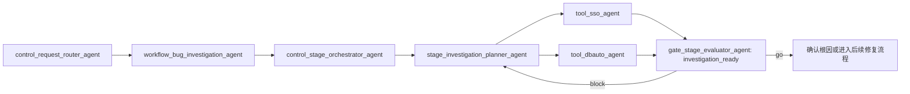

# 问题排查先查什么证据

## 摘要

“dbauto 已启动但没有真正导出”不能直接进入修复。环境 ready、登录有效和业务导出完成是三个不同事实；调查 Workflow 必须逐项验证，再决定继续取证、进入修复或按事实收口。

## 目标链路

## 证据问题

| 问题 | 证据 | 不能推出什么 |
| --- | --- | --- |
| SSO 是否有效 | 实际会话检查 | 业务页面一定完成导出 |
| runtime 是否 ready | 进程、页面、Bridge 或 wrapper 结果 | 用户动作已经执行 |
| 导出是否完成 | 导出文件、下载事件、页面结果或任务记录 | 文件内容一定正确 |
| 导出内容是否正确 | 文件结构与业务字段校验 | 上游数据本身无误 |

## Gate 判定

- 只有环境 ready：证据不足，不能宣布导出完成。
- 登录和 runtime 正常、没有业务动作证据：根因倾向“尚未执行或未完成动作”，但仍需给出可证伪条件。
- 有导出结果但内容错误：进入下一轮数据来源或转换逻辑调查。
- 发现代码缺陷：先通过调查门禁，再回到产品/设计/测试范围确认后进入修复。

Tool 返回事实，`stage_investigation_planner_agent` 综合假设，Gate 只判断证据是否足够；三者不能互相替代。
