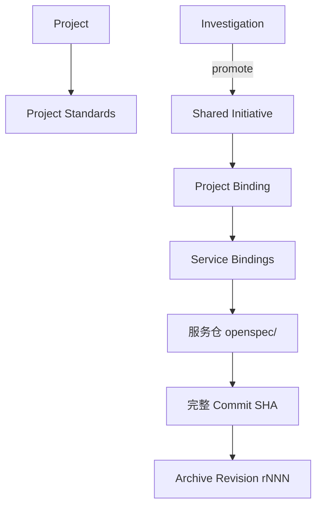

# my-openspec当前架构和对象模型

## 摘要

中央仓库保存稳定对象、跨项目绑定和不可变归档；服务仓自己的 `openspec/` 保存开发期间的详细需求、设计、测试和交付事实。两者不是副本关系，也不应频繁双写。

## 当前目录

```text
my-openspec/
├── projects/
├── initiatives/
├── investigations/
├── archive/
├── schemas/
├── templates/
├── openspec_cli/
├── bin/openspec
├── tests/
├── README.md
├── AGENTS.md
└── move-guidence.md
```

| 目录 | 当前职责 |
| --- | --- |
| `projects/` | 项目标识和 requirement、backend-design、testing、code-review、delivery 规范 |
| `initiatives/_shared/` | 跨项目共享的 Initiative 身份、概览、项目地图和收口信息 |
| `initiatives/<projectKey>/` | 每个参与项目的 Binding |
| `investigations/` | 问题事实、证据、结论和转需求关系 |
| `archive/` | Revision manifest、中央对象、Binding 和服务仓 OpenSpec 快照 |
| `schemas/` | Project、Initiative、Binding、Investigation 和 Archive Revision 约束 |
| `templates/` | 新项目规范模板 |
| `openspec_cli/` | CLI 参数解析与核心业务逻辑 |

## 对象关系



一个正式需求只有一个 `_shared` Initiative；每个参与项目只有一个 Binding；一个 Binding 可以包含多个 `serviceBindings`。

## 安全边界

- 不在中央元数据保存凭据、生产导出或本机 checkout 路径。
- 不把业务源码复制进 Initiative。
- 归档只接受完整 Commit SHA，并从该 Commit 读取服务仓 OpenSpec。
- 项目内 `openspec/` 是开发期间唯一持续更新的详细事实。
- 中央仓库不注册 Workflow、Stage、Tool 或 Gate Agent。

## 可执行动作

- 新增对象前先确认 Project、Initiative 和 Binding 的唯一身份。
- 多服务需求在同一项目 Binding 下登记多个服务，不复制 Initiative。
- 归档前确认服务证据路径是仓库相对路径。

## 相关链接

- [[my-openspec总览]]
- [[my-openspec CLI与归档流程]]
- [[my-openspec与Multi-Agent串联及迁移]]
