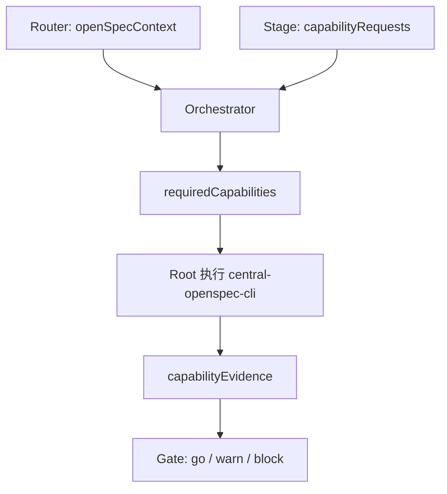

# my-openspec与Multi-Agent串联及迁移

## 摘要

两套系统保持独立。Multi-Agent 决定 Workflow、Stage 和 Gate；`my-openspec` 提供对象、schema、CLI、校验和归档。连接点是 `openSpecContext` 和 Root 执行的 `central-openspec-cli` 证据。

## 串联方式

| 组件 | OpenSpec 责任 |
| --- | --- |
| Router | 绑定 mode、projectKeys、Initiative 或 Investigation 身份 |
| Stage | 维护项目内事实，提出结构化能力请求 |
| Orchestrator | 校验、去重并维护待执行能力 |
| Root | 执行 CLI，回填 JSON、退出码和产物路径 |
| Gate | 只消费匹配证据，不执行或修补 CLI 操作 |

交付后使用 `collect-project-result` 收集服务最终结果；测试环境通过且 `check-archive-ready` 的证据被 Gate 接受后，才执行 `archive-initiative`。

## 迁移规则

重命名或移动中央仓库前，必须完整读取仓库根目录 `move-guidence.md`。核心顺序：

1. 记录源目录 HEAD、remote、dirty/untracked、worktree 和可执行权限。
2. 同盘原位移动；跨盘先复制并保留源目录。
3. 更新 Router、Orchestrator、能力矩阵、桥接校验、工作区规则和 Obsidian 当前入口。
4. 重新运行 Agent catalog、OpenSpec workspace、单元测试和 bridge 校验。
5. 验证完成前不清理源目录；跨盘源目录清理由用户单独授权。

迁移不能修改 Project、Initiative、Binding、服务 `openSpecPath` 或 Git remote。

## 可执行动作

- 日常检查：`python3 ~/.codex/agent-catalog-runtime/check_openspec_bridge.py`
- OpenSpec 校验：`bin/openspec validate-workspace`
- 迁移时只以 `move-guidence.md` 的当前版本为准。

## 相关链接

- [[my-openspec总览]]
- [[Multi-Agent与OpenSpec边界]]
- [[当前运行架构和统一流程]]
- [[xuetao-library总览]]
